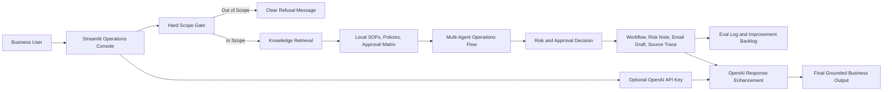
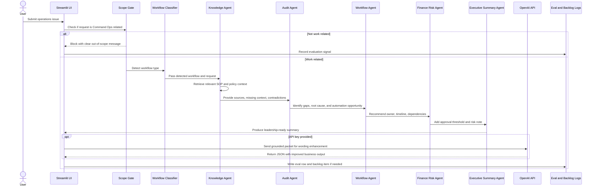
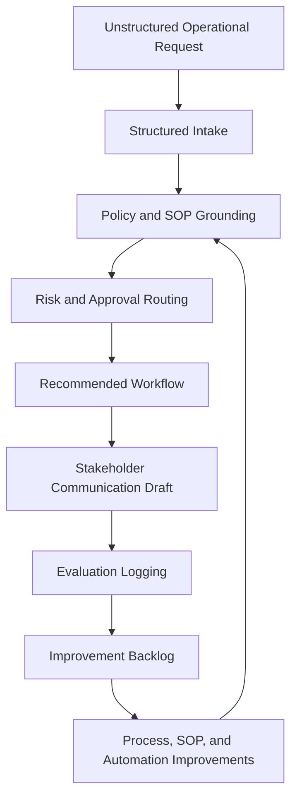
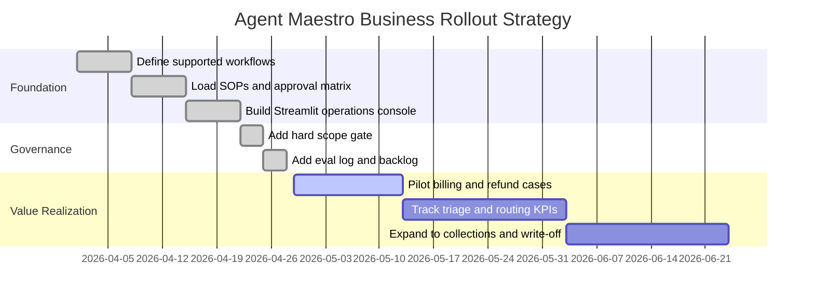

# Agent Maestro: System Working, Business Relevance, and Value Realization

## Executive View

Agent Maestro is a Command Ops intelligence application built in Streamlit. It helps operations teams handle work requests such as refunds, billing issues, login problems, cash application, collections, bad debt, audit requests, Marketing Cloud readiness, AI governance, SOP gaps, approvals, and escalations.

The system does not act like a general chatbot. It is designed as a controlled business workflow assistant. It first checks whether the user request is relevant to Command Ops work, retrieves local policy and SOP context, evaluates risk and approval requirements, generates a recommended workflow, drafts stakeholder communication, and logs evaluation signals for continuous improvement.

In business terms, Agent Maestro turns messy operational intake into a structured, auditable, decision-ready workflow.

Agent Maestro demonstrates my ability to bridge AI, operations, governance, process improvement, and executive decision support.

## Why I Built This

I built Agent Maestro because most AI tools fail in operations when they are not grounded in process, policy, governance, and human judgment.

In real business workflows, the hard part is not simply generating a polished answer. The hard part is knowing whether the request belongs in scope, which SOP applies, what approval threshold matters, who owns the next action, what risk level applies, and how the organization learns from repeated issues.

Agent Maestro is designed around that insight. It does not just answer. It routes, checks, flags, documents, and improves.

## What Makes This Different

Agent Maestro is not a chatbot. It is a governed operations workflow system.

The difference is that it does not just respond to a user prompt. It:

- Detects the workflow type automatically from the request.
- Blocks unrelated questions before retrieval or LLM use.
- Grounds the response in local SOP and policy context.
- Applies risk and approval logic.
- Shows role-specific decision views for Analysts, Managers, and Directors.
- Estimates time saved, cost impact, SLA improvement, and risk avoided.
- Flags exceptions such as missing data, policy conflict, or sensitive customer-impact claims.
- Maps confidence levels to required actions.
- Tracks human decision overrides for governance.
- Shows policy versions and source traceability.
- Splits multi-part requests into sub-tasks.
- Monitors queue throughput and agent failure patterns.
- Estimates LLM usage cost and can skip enhancement when confidence is too low.
- Detects sensitive data and recommends handling controls.
- Simulates enterprise integrations such as Zendesk, Salesforce, and Slack.
- Logs evaluation signals and human feedback for continuous improvement.

This makes the system closer to an operations control layer than a generic AI assistant.

## My Role

I owned the end-to-end product and implementation:

- Designed the operating model for a governed Command Ops AI workflow.
- Built the Streamlit operations console.
- Created automatic request-type detection.
- Structured local SOP, policy, process-map, known-issue, and email-template retrieval.
- Defined deterministic risk logic, approval routing, priority scoring, and exception handling.
- Added role-based decision views for Analyst, Manager, and Director users.
- Built the KPI and business-impact estimator.
- Created eval logging, human feedback capture, and improvement backlog generation.
- Framed the system for AI governance, operational ROI, and executive decision support.
- Added automated tests for routing, risk detection, memory, feedback, parsing, and enterprise decision layers.

## Problem It Solves

Many operations teams lose time and control because work arrives in unstructured form: emails, support notes, Slack threads, customer tickets, spreadsheet comments, or ad hoc requests from internal teams. The same issue can be handled differently depending on who receives it, which creates inconsistent approvals, missed SOPs, slow escalations, and weak audit trails.

Agent Maestro addresses these problems:

- Ambiguous request intake with missing facts.
- Manual triage across billing, refunds, collections, governance, and workflow issues.
- Inconsistent approval routing for financial or customer-impacting decisions.
- Slow identification of policy gaps and outdated SOPs.
- Poor visibility into recurring operational failures.
- Lack of measurable feedback loops for process improvement.
- Risky use of AI for unrelated or non-business questions.

The system solves this by combining deterministic business rules, local knowledge retrieval, risk scoring, human-readable workflow generation, and optional OpenAI-powered response enhancement.

## Business Context

Companies are increasingly using AI inside real operational workflows, but value does not come from adding a chatbot alone. Value comes when AI is embedded into the business process, tied to policy, measured through KPIs, and governed with human validation.

Recent business research supports this direction:

- McKinsey's 2025 State of AI survey reports that 88% of respondents say their organizations use AI in at least one business function, but only about one-third are scaling AI across the organization. The same research notes that high performers are more likely to redesign workflows, track KPIs, and embed AI into business processes.
- McKinsey's 2026 customer-care research says AI leaders are treating customer operations as strategic value engines, not only cost centers. It highlights workflow automation, knowledge retrieval, recommended next best action, and agentic systems as major customer-care use cases.
- Microsoft published more than 1,000 AI transformation stories in 2025, including examples of automated sales call auditing, customer retention analysis, and field service process automation projected to save 35,000 work hours and improve productivity by at least 25%.

Agent Maestro follows the same business pattern: it is not AI for novelty. It is AI placed inside a real operational control flow.

## Solution

Agent Maestro provides a Streamlit-based operations console where any user can:

- Enter an OpenAI API key in the sidebar.
- Submit an operations request.
- Let the system automatically detect the workflow type.
- Receive a structured agent response.
- See priority, risk level, confidence, detected workflow, context sources, handoffs, failed checks, workflow steps, risk notes, and an email draft.
- View role-specific outputs for Analyst, Manager, and Director users.
- Review similar past cases, business-impact estimates, exception flags, and integration simulation signals.
- Submit human feedback and corrections.
- Track decision overrides, override reasons, approver, and root cause.
- Review policy versions and source update metadata used in the decision.
- See multi-request sub-task breakdowns.
- Review an evaluation dashboard that captures quality signals, feedback, overrides, queue trends, agent failures, and improvement backlog items.

The app uses local SOPs and policy documents as the source of truth. If an OpenAI API key is provided, the OpenAI API improves the final wording and completeness of the grounded output. It is not allowed to change risk scoring, sources, approval owners, or core facts.

## Before and After

| Before Agent Maestro | After Agent Maestro |
|---|---|
| Unstructured Slack, email, ticket, or spreadsheet requests | Structured operational intake |
| Manual SOP lookup | Policy-grounded response |
| Manual request categorization | Automatic workflow detection |
| Approval confusion | Risk-based approval routing |
| Repeated escalations | Clear owner, priority, and next steps |
| Hidden process gaps | Logged improvement backlog |
| Generic AI answer | Governed operations workflow |
| Same output for every user | Role-specific Analyst, Manager, and Director views |
| No business-value signal | Estimated time saved, cost impact, SLA improvement, and risk avoided |

## Demo Walkthrough

A viewer can run the demo with a realistic request such as:

`Customer asks for a $75,000 refund and says the issue caused emotional distress.`

The demo flow shows:

1. The user submits only the operations request.
2. The system automatically detects the workflow type, such as Refund Approval.
3. The hard scope gate checks whether the request belongs to Command Ops.
4. The Knowledge Agent retrieves SOP, policy, approval, known-issue, and process context.
5. The system flags risk, priority, approval owner, confidence, and exception reasons.
6. Confidence is mapped to an action such as proceed, manager validation, or manual escalation.
7. The app splits multi-part requests into sub-tasks, such as refund workflow, login support, and CX escalation.
8. The app shows role-specific views for Analyst, Manager, and Director.
9. The Workflow Agent generates execution steps and dependencies.
10. The Finance Risk Agent applies approval thresholds and governance notes.
11. The Executive Summary Agent creates a boardroom-ready summary.
12. The app generates a stakeholder email draft.
13. The app shows policy versions, data-sensitivity flags, and fallback guidance.
14. The user can log feedback or decision overrides.
15. The dashboard shows eval logs, feedback, overrides, queue trends, agent failure patterns, suggested rule updates, and improvement backlog items.

## Visual Assets to Include

| Asset | Purpose |
|---|---|
| Architecture diagram | Shows system thinking and end-to-end control flow |
| Refund request screenshot | Shows a realistic high-value workflow |
| Auto-detected workflow screenshot | Shows that users do not need to select request type manually |
| Eval dashboard screenshot | Shows AI observability |
| Improvement backlog screenshot | Shows continuous improvement |
| KPI and business-impact screenshot | Shows executive relevance |
| Role-based view screenshot | Shows Analyst, Manager, and Director decision support |
| Decision override screenshot | Shows enterprise AI governance |
| Queue and agent-performance dashboard screenshot | Shows operational observability |
| Policy version trace screenshot | Shows audit-grade source traceability |

## Hard Business Rules

Agent Maestro has a hard scope gate.

If a question is not related to Command Ops work, the system clearly says it cannot help and blocks the agent flow. The request is not sent to retrieval and is not sent to OpenAI.

Supported scope includes:

- Audit requests.
- Workflow issues.
- Billing issues.
- Refund approvals.
- Billing login support.
- Cash application.
- Collections.
- Bad debt write-off.
- Marketing Cloud launch readiness.
- AI governance.
- SOP, policy, approval, escalation, and operational control issues.

This rule is important because business AI must remain focused, governed, and auditable.

## High-Level Architecture

## Detailed Workflow

## Agent Responsibilities

| Agent | Business Role | Output |
|---|---|---|
| Scope Gate | Protects the system from unrelated usage | Blocks non-work questions before retrieval or LLM use |
| Workflow Classifier | Detects the operational workflow automatically | Request type, classification confidence, matched reasons |
| Knowledge Agent | Grounds the request in SOP and policy context | Sources, context snippets, missing-context signal, contradiction signal |
| Audit Agent | Reviews process and control gaps | Root cause, process risk, automation opportunities |
| Workflow Agent | Turns analysis into execution | Owner, timeline, dependencies, escalation path |
| Finance Risk Agent | Protects financial and compliance controls | Approval band, risk level, governance note |
| Executive Summary Agent | Makes the output decision-ready | Business impact and next action |

## Role-Based Decision Layer

Agent Maestro supports different views for different business users:

| Role | What They Need | Agent Maestro Output |
|---|---|---|
| Analyst | Execution steps | Evidence to collect, workflow steps, dependencies, timeline |
| Manager | Decision support | Approval owner, risk level, exception status, priority |
| Director | Business impact | Escalation path, financial exposure, risk avoided, recommendation |

This matters because executives do not want procedural steps first. They need decision, risk, impact, and recommendation.

## Memory and Feedback Layer

Agent Maestro includes an operational memory pattern:

- Similar past case retrieval from eval logs.
- Typical historical resolution signal.
- Previous risk-level reference.
- Human feedback capture: Correct, Incorrect, and Add correction.
- Feedback-driven improvement backlog items.

This turns daily workflow handling into a learning loop. The system does not retrain itself automatically, but it creates the operational evidence needed to improve SOPs, routing rules, policy coverage, and future agent behavior.

## Decision Override Tracking

Agent Maestro now includes decision override tracking because real enterprise AI governance requires more than thumbs-up or thumbs-down feedback.

The system captures:

- Override occurred: Yes or No.
- Why the human overrode the system.
- Who approved the override.
- Whether the root cause was system error, incomplete policy, customer exception, or business judgment.

Example:

| Field | Example |
|---|---|
| Override occurred | Yes |
| Reason | Customer retention exception |
| Approved by | Director |
| Root cause | Policy incomplete |

Override events are logged and routed into the improvement backlog. This helps the business distinguish between a model mistake, an incomplete SOP, and a legitimate business exception.

## Confidence to Action Mapping

Confidence is not shown as a decorative score. It drives operational behavior.

| Confidence / Risk Signal | Required Action |
|---|---|
| High confidence and no blocking exception | Proceed through standard governed workflow |
| Medium confidence or high risk | Requires manager validation before execution |
| Low confidence, missing context, or critical risk | Escalate for manual review before execution |

Example:

`Confidence: 62%`

`Action: Requires manager validation before execution`

This makes the system safer because lower confidence does not produce a polished but unsafe answer. It changes the required review path.

## Policy Versioning and Traceability

The system shows which local policy or SOP source was used, with audit-friendly metadata:

- Source file.
- Policy or SOP name.
- Version signal.
- Last updated signal.

Example:

`Policy: Refund Policy Global v3.2`

`Updated: 2026-01`

This matters because operational AI needs traceability. A reviewer should be able to see not only the answer, but which policy version influenced the recommendation.

## Multi-Request Context Handling

Real operations requests are often multi-part. A single request can contain a refund, a login issue, and a customer complaint.

Agent Maestro breaks these into sub-tasks:

| Input Signal | Sub-Task |
|---|---|
| Refund amount or refund request | Refund Approval workflow |
| Billing portal, password, or access issue | Billing Login workflow |
| Complaint, distress, escalation, or customer-impact language | CX Escalation |
| Legal, lawsuit, attorney, or damages language | Legal Review |

Example:

`Customer requests a $75,000 refund, cannot access the billing portal, and says the issue caused emotional distress.`

Sub-tasks:

- Refund Approval.
- Billing Login.
- CX Escalation.
- Legal Review.

This better matches real intake, where one messy request may require multiple owners.

## Priority and Exception Intelligence

The system assigns priority using:

- Risk level.
- Dollar amount.
- SLA sensitivity.
- Missing context.
- Policy contradiction.
- Sensitive customer-impact or legal language.

Example:

`Customer asks for a $75,000 refund and says the issue caused emotional distress.`

Expected output:

- Detected workflow: Refund Approval.
- Risk: Critical.
- Priority: Critical, handle immediately.
- Owner: VP Finance + Legal.
- Exception: sensitive customer-impact claim and critical escalation required.
- Recommendation: do not commit to the customer until evidence, approval, and legal/customer-success review are complete.

## Throughput and Queue View

Agent Maestro includes a dashboard view that makes the application feel like an operations system, not a one-off tool.

The dashboard shows:

- Open request count.
- High-risk queue count.
- SLA breach risk based on improvement-needed signals.
- Workload distribution by request type and risk level.
- Recent queue items with timestamp, detected workflow, risk level, confidence, and improvement-needed flag.

This helps operations leaders answer:

- What is in the queue?
- Which cases are risky?
- Which workflows create the most operational load?
- Where should the team focus first?

## Agent Performance Monitoring

The system logs failed agent checks so the team can see where the workflow breaks down.

Example failure sources:

| Failure Source | Example Failure |
|---|---|
| Knowledge Agent | Missing context |
| Workflow Agent | Owner not assigned |
| Finance Risk Agent | Human approval path incomplete |
| Executive Summary Agent | Business impact missing |

This is important because AI observability should not only ask whether the final answer looked good. It should identify which part of the agent flow failed and why.

## Dynamic Learning and Rule Update Suggestions

Agent Maestro does not silently change production rules. Instead, it suggests rule updates from repeated operational signals.

Examples:

- Multiple refund cases missing policy context -> suggest refund SOP update.
- Repeated high-risk override reasons -> suggest approval rule review.
- Repeated missing owner patterns -> suggest ownership matrix update.

This creates a governed learning loop. The system can recommend improvements, but humans still validate policy and process changes.

## Cost Control Layer

OpenAI enhancement is optional and cost-aware.

The system estimates:

- Input tokens.
- Output tokens.
- Estimated API cost.
- Whether LLM enhancement should run or be skipped.

The system can skip LLM enhancement when confidence is too low or manual review is required. This prevents spending tokens to polish an answer that should not be executed yet.

## Security and Data Sensitivity Layer

Agent Maestro detects sensitive data signals such as:

- Customer financial information.
- Email addresses.
- Potential payment card numbers.
- Government identifiers.
- Sensitive customer-impact language.

The app then assigns a sensitivity level such as Internal, Confidential, or Restricted and recommends handling controls. This is important because operational requests often contain financial and customer-impact details.

## Failure Mode UX

When the system is unsure, it does not pretend to be certain.

Examples:

- `Insufficient context - recommend manual review.`
- `Critical risk - escalate before execution.`
- `Sensitive data detected - mask before external sharing.`
- `OpenAI enhancement skipped until manual review clears context.`

This fallback behavior is essential for safe enterprise AI.

## Data and Knowledge Sources

Agent Maestro uses local business context from:

- `data/sample_sops/`
- `data/approval_matrix.csv`
- `agent_maestro_kb/sops/`
- `agent_maestro_kb/policies/`
- `agent_maestro_kb/process_maps/`
- `agent_maestro_kb/known_issues/`
- `agent_maestro_kb/email_templates/`
- `agent_maestro_kb/data_approval_matrix.csv`

This design makes the system business-grounded. The AI output is not floating on general knowledge; it is tied to local operating procedures, approval policies, known issues, and process maps.

## Value Realization Flow

The value loop matters because the system does more than answer one request. It captures signals that show where the business process itself is weak. If confidence is low, context is missing, or risk is high, Agent Maestro creates improvement backlog items. That turns day-to-day issue handling into a source of operational intelligence.

## Estimated Pilot Impact Targets

These are estimated targets for a pilot, not measured production results.

| Impact Area | Estimated Target |
|---|---|
| Triage time | 30-50% reduction |
| First response time | 20-30% faster |
| Approval-routing errors | Lower error rate through threshold-based routing |
| SOP gap visibility | Higher visibility through missing-context and backlog logs |
| Stakeholder communication | More consistent status updates and email drafts |
| Governance quality | Better traceability for risk, approvals, exceptions, and human feedback |

The system is designed to make these targets measurable through eval logs, feedback logs, improvement backlog items, and dashboard trends.

## Business Value Impact

Agent Maestro adds value in several visible ways.

### 1. Faster Triage

The user does not need to manually search SOP folders, approval matrices, policy files, and old process notes. The system retrieves likely relevant context and turns it into a recommended action path.

Expected business impact:

- Reduced handling time.
- Faster first response.
- Less dependency on tribal knowledge.
- Better frontline confidence.

### 2. Better Control and Compliance

Refunds, billing issues, collections, write-offs, and governance requests often carry financial or audit risk. Agent Maestro checks approval thresholds and risk levels before recommending action.

Expected business impact:

- Fewer unauthorized approvals.
- Stronger audit trail.
- Clearer ownership.
- More consistent policy application.

### 3. Improved Customer and Stakeholder Experience

The system creates a clear workflow and communication draft. This helps teams respond with less delay and less confusion.

Expected business impact:

- Better customer trust.
- Reduced back-and-forth.
- More consistent stakeholder updates.
- Faster resolution of high-friction requests.

### 4. Operational Fluency

Operational fluency means the business can move from issue to action smoothly. Agent Maestro supports that by translating messy requests into:

- What happened.
- Which policy applies.
- Who owns it.
- What risk level applies.
- What needs approval.
- What should happen next.
- What communication should be sent.

This improves the team's ability to execute without waiting for a senior expert every time.

### 5. Continuous Improvement

Every run can produce evaluation data. Missing context, low confidence, and high risk become measurable signals.

Expected business impact:

- Clear SOP improvement backlog.
- Better policy coverage over time.
- More accurate agent behavior over time.
- Stronger governance around AI-assisted decisions.

## Strategic Business Value

Agent Maestro supports a broader business strategy: move from reactive operations to intelligent operations.

| Current State | Future State With Agent Maestro |
|---|---|
| Manual triage | AI-assisted structured triage |
| Policy lookup by memory | Policy-grounded recommendations |
| Inconsistent approvals | Approval-band routing |
| Hidden process gaps | Logged improvement backlog |
| Reactive escalations | Risk-based escalation |
| Generic AI answers | Domain-scoped, auditable AI |
| One-off fixes | Continuous process learning |

Strategically, this positions the operations function as a source of business intelligence. The team can identify process friction, recurring policy gaps, and high-risk work patterns instead of only closing tickets.

## Real Business Relevance Example

A realistic enterprise example is customer operations for billing and refunds.

Imagine a SaaS company receives repeated customer complaints about duplicate charges and failed billing portal logins. Without Agent Maestro, support might manually search old SOPs, ask finance in chat, wait for a manager to confirm the refund threshold, and draft an inconsistent customer update.

With Agent Maestro:

1. The user submits: `Customer asks for a $7,500 refund after duplicate billing and login failure.`
2. The system classifies it as a refund or billing issue.
3. The Knowledge Agent retrieves refund, billing login, and approval policy context.
4. The Finance Risk Agent detects a high-value refund and routes to the Finance Director or required owner.
5. The Workflow Agent provides the action plan, dependencies, and timeline.
6. The Executive Summary Agent creates a leadership-ready summary.
7. The app logs that the case is high risk and creates a backlog signal if governance review is needed.

Visible value realization:

- The customer issue moves faster.
- The refund is not approved outside policy.
- Finance gets the right evidence.
- The customer communication is drafted immediately.
- The business learns whether this is a recurring process defect.

This is directly aligned with current customer-care AI trends. McKinsey notes that leading customer-care organizations are using AI for knowledge retrieval, workflow automation, recommended next best action, and human-agent collaboration. Microsoft also reports real AI customer examples where process automation and auditing are projected to save large numbers of work hours.

## Risk Management and Governance

Agent Maestro is designed with control points:

- Hard scope gate blocks unrelated questions.
- Local SOP and policy retrieval grounds the output.
- Missing context is explicitly flagged.
- Contradictions and outdated policy context are flagged.
- High and critical risk cases require escalation.
- OpenAI enhancement cannot override fixed business facts.
- Evaluation logs create traceability.
- Improvement backlog captures recurring process weakness.

This makes the system safer for business use than a generic chatbot because it preserves boundaries, sources, and review signals.

## KPI Framework

The business value should be measured with operational KPIs.

| KPI | Why It Matters |
|---|---|
| Average triage time | Shows speed improvement |
| First-response time | Measures customer/stakeholder impact |
| Approval routing accuracy | Measures control quality |
| Missing-context rate | Shows SOP coverage gaps |
| High-risk case volume | Shows governance load |
| Repeat issue count | Reveals recurring operational defects |
| Backlog closure rate | Shows continuous improvement |
| Human override rate | Measures trust and model/process fit |
| Customer satisfaction impact | Connects workflow quality to experience |
| Cost per handled request | Shows efficiency value |
| Decision override rate | Shows where humans disagree with the system |
| Agent failure rate | Shows which agent step needs improvement |
| LLM cost per request | Shows AI operating cost |
| Sensitive-data detection rate | Shows data-risk load |
| Manual review rate | Shows confidence and governance burden |

## Tech Stack

| Layer | Tools |
|---|---|
| UI | Streamlit |
| AI workflow | Deterministic agent orchestration, CrewAI-compatible structure, optional OpenAI response enhancement |
| Data | Pandas, CSV logs, Markdown SOPs and policies |
| Knowledge base | Local SOPs, policies, process maps, known issues, email templates, approval matrix |
| Governance | Hard scope gate, workflow classifier, approval matrix, risk logic, exception detection |
| Observability | Eval logs, human feedback logs, decision override logs, agent performance logs, improvement backlog, dashboard trends |
| Business value | KPI estimator, priority scoring, risk avoided, cost impact, SLA impact |
| Cost control | Token and API cost estimate, skip-LLM decision policy |
| Security | Sensitive data detection, sensitivity levels, handling guidance |
| Deployment readiness | Requirements file, README, modular files, automated tests |

## Implementation Strategy

Recommended rollout:

1. Start with high-volume, policy-heavy workflows such as billing, refunds, and login support.
2. Measure triage time, approval accuracy, and missing-context rate.
3. Review failed checks weekly.
4. Convert repeated missing-context signals into SOP updates.
5. Expand to collections, cash application, bad debt, Marketing Cloud readiness, and AI governance.
6. Use OpenAI enhancement for clearer communication while keeping deterministic business rules fixed.

## Why This Is Not Just a Demo

The system demonstrates real operational capabilities:

- It has a usable Streamlit interface.
- It supports API-key entry so different users can run it.
- It has a hard domain boundary.
- It automatically detects workflow type from the user's request.
- It retrieves local business context.
- It evaluates risk and approval bands.
- It prioritizes work based on risk, value, SLA sensitivity, and missing context.
- It detects exceptions and escalation needs.
- It shows role-specific outputs.
- It estimates business impact.
- It maps confidence to required action.
- It tracks human decision overrides.
- It shows policy version traceability.
- It breaks multi-part requests into sub-tasks.
- It estimates LLM usage cost and can skip enhancement when review is required.
- It detects sensitive data and recommends handling controls.
- It creates workflow recommendations.
- It generates communication drafts.
- It logs eval signals.
- It captures human feedback.
- It monitors agent failure patterns.
- It shows queue and throughput signals.
- It creates improvement backlog items.
- It has automated tests.

That combination shows both technical implementation and business relevance.

## Current Limitations

Agent Maestro is intentionally built as a realistic prototype, not a production enterprise deployment.

Current limitations:

- Uses sample and local SOP data rather than live enterprise policy systems.
- Risk logic is deterministic and rule-based, not yet connected to production approval engines.
- Similar-case memory uses local CSV eval logs rather than a full case-management data warehouse.
- Policy version metadata is inferred from local files and should be replaced with official document metadata in production.
- Decision overrides are logged locally and should be connected to enterprise approval systems in production.
- LLM cost estimates are approximate and should be replaced with provider usage telemetry for production reporting.
- Sensitive-data detection is rule-based and should be strengthened with enterprise DLP controls.
- ROI numbers are pilot targets until measured with real users.
- Requires stronger authentication, authorization, and permissioning before production use.
- OpenAI enhancement improves wording but does not replace deterministic policy, risk, approval, and source facts.

Future versions should integrate with:

- Slack or Microsoft Teams for intake and escalation.
- Salesforce, Zendesk, Jira, ServiceNow, or Certinia for ticket and case sync.
- Enterprise identity and role permissions.
- A production knowledge base or document-management system.
- Live KPI reporting for measured ROI.
- Human approval workflows with audit-ready signoff records.

## LinkedIn-Ready Summary

I built Agent Maestro to explore what operational AI should look like when it is grounded in process, policy, governance, and human judgment.

It is not a general chatbot. It is a governed Command Ops workflow system that detects the request type, retrieves SOP and policy context, evaluates risk, routes approvals, generates role-specific recommendations, estimates business impact, captures feedback, and logs improvement signals.

I also added enterprise AI governance features: confidence-to-action mapping, decision override tracking, policy version traceability, data sensitivity detection, LLM cost awareness, queue monitoring, agent performance monitoring, and suggested rule updates.

The goal was to show how AI can move from reactive answers to intelligent operations: structured intake, auditable decisions, continuous improvement, and executive-ready value visibility.

## Highest-Impact Additions Before Posting

| Priority | Addition |
|---|---|
| Must-have | My Role section |
| Must-have | Before/After table |
| Must-have | Demo walkthrough |
| Must-have | Screenshots and visual assets |
| Strong add | Estimated KPI targets |
| Strong add | Limitations and next version |
| Strong add | LinkedIn-ready summary |

## Source Links

- McKinsey, *The State of AI: Global Survey 2025*: https://www.mckinsey.com/capabilities/quantumblack/our-insights/the-state-of-ai/
- McKinsey, *How customer care leaders pull ahead with AI*: https://www.mckinsey.com/capabilities/operations/our-insights/building-trust-how-customer-care-leaders-pull-ahead-with-ai
- Microsoft, *AI-powered success with more than 1,000 stories of customer transformation and innovation*: https://www.microsoft.com/en-us/microsoft-cloud/blog/2025/07/24/ai-powered-success-with-1000-stories-of-customer-transformation-and-innovation/
