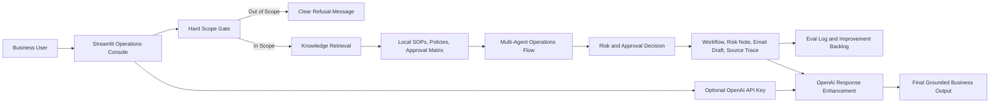
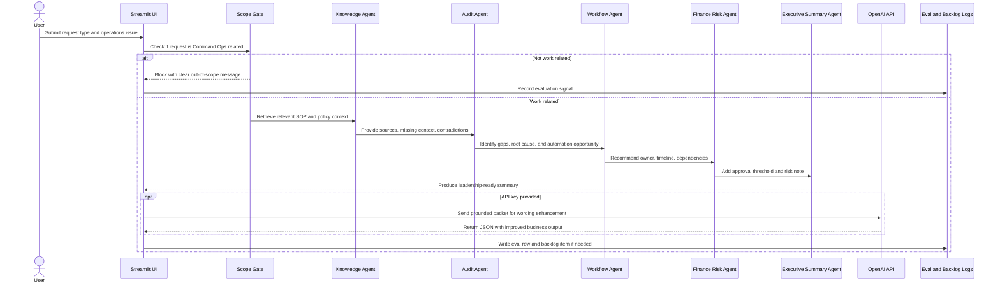
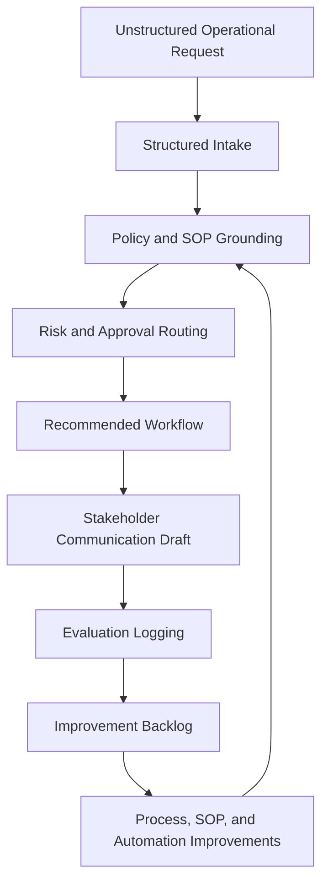
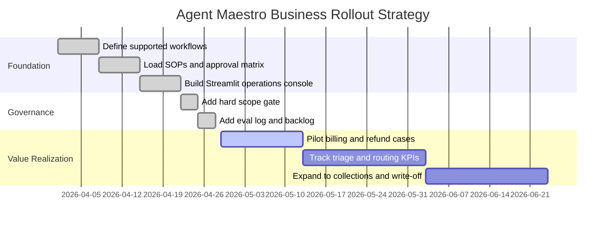

# Agent Maestro: System Working, Business Relevance, and Value Realization

## Executive View

Agent Maestro is a Command Ops intelligence application built in Streamlit. It helps operations teams handle work requests such as refunds, billing issues, login problems, cash application, collections, bad debt, audit requests, Marketing Cloud readiness, AI governance, SOP gaps, approvals, and escalations.

The system does not act like a general chatbot. It is designed as a controlled business workflow assistant. It first checks whether the user request is relevant to Command Ops work, retrieves local policy and SOP context, evaluates risk and approval requirements, generates a recommended workflow, drafts stakeholder communication, and logs evaluation signals for continuous improvement.

In business terms, Agent Maestro turns messy operational intake into a structured, auditable, decision-ready workflow.

## Problem It Solves

Many operations teams lose time and control because work arrives in unstructured form: emails, support notes, Slack threads, customer tickets, spreadsheet comments, or ad hoc requests from internal teams. The same issue can be handled differently depending on who receives it, which creates inconsistent approvals, missed SOPs, slow escalations, and weak audit trails.

Agent Maestro addresses these problems:

- Ambiguous request intake with missing facts.
- Manual triage across billing, refunds, collections, governance, and workflow issues.
- Inconsistent approval routing for financial or customer-impacting decisions.
- Slow identification of policy gaps and outdated SOPs.
- Poor visibility into recurring operational failures.
- Lack of measurable feedback loops for process improvement.
- Risky use of AI for unrelated or non-business questions.

The system solves this by combining deterministic business rules, local knowledge retrieval, risk scoring, human-readable workflow generation, and optional OpenAI-powered response enhancement.

## Business Context

Companies are increasingly using AI inside real operational workflows, but value does not come from adding a chatbot alone. Value comes when AI is embedded into the business process, tied to policy, measured through KPIs, and governed with human validation.

Recent business research supports this direction:

- McKinsey's 2025 State of AI survey reports that 88% of respondents say their organizations use AI in at least one business function, but only about one-third are scaling AI across the organization. The same research notes that high performers are more likely to redesign workflows, track KPIs, and embed AI into business processes.
- McKinsey's 2026 customer-care research says AI leaders are treating customer operations as strategic value engines, not only cost centers. It highlights workflow automation, knowledge retrieval, recommended next best action, and agentic systems as major customer-care use cases.
- Microsoft published more than 1,000 AI transformation stories in 2025, including examples of automated sales call auditing, customer retention analysis, and field service process automation projected to save 35,000 work hours and improve productivity by at least 25%.

Agent Maestro follows the same business pattern: it is not AI for novelty. It is AI placed inside a real operational control flow.

## Solution

Agent Maestro provides a Streamlit-based operations console where any user can:

- Enter an OpenAI API key in the sidebar.
- Choose a business request type.
- Submit an operations request.
- Receive a structured agent response.
- See confidence, risk level, context sources, handoffs, failed checks, workflow steps, risk notes, and an email draft.
- Review an evaluation dashboard that captures quality signals and improvement backlog items.

The app uses local SOPs and policy documents as the source of truth. If an OpenAI API key is provided, the OpenAI API improves the final wording and completeness of the grounded output. It is not allowed to change risk scoring, sources, approval owners, or core facts.

## Hard Business Rules

Agent Maestro has a hard scope gate.

If a question is not related to Command Ops work, the system clearly says it cannot help and blocks the agent flow. The request is not sent to retrieval and is not sent to OpenAI.

Supported scope includes:

- Audit requests.
- Workflow issues.
- Billing issues.
- Refund approvals.
- Billing login support.
- Cash application.
- Collections.
- Bad debt write-off.
- Marketing Cloud launch readiness.
- AI governance.
- SOP, policy, approval, escalation, and operational control issues.

This rule is important because business AI must remain focused, governed, and auditable.

## High-Level Architecture

## Detailed Workflow

## Agent Responsibilities

| Agent | Business Role | Output |
|---|---|---|
| Scope Gate | Protects the system from unrelated usage | Blocks non-work questions before retrieval or LLM use |
| Knowledge Agent | Grounds the request in SOP and policy context | Sources, context snippets, missing-context signal, contradiction signal |
| Audit Agent | Reviews process and control gaps | Root cause, process risk, automation opportunities |
| Workflow Agent | Turns analysis into execution | Owner, timeline, dependencies, escalation path |
| Finance Risk Agent | Protects financial and compliance controls | Approval band, risk level, governance note |
| Executive Summary Agent | Makes the output decision-ready | Business impact and next action |

## Data and Knowledge Sources

Agent Maestro uses local business context from:

- `data/sample_sops/`
- `data/approval_matrix.csv`
- `agent_maestro_kb/sops/`
- `agent_maestro_kb/policies/`
- `agent_maestro_kb/process_maps/`
- `agent_maestro_kb/known_issues/`
- `agent_maestro_kb/email_templates/`
- `agent_maestro_kb/data_approval_matrix.csv`

This design makes the system business-grounded. The AI output is not floating on general knowledge; it is tied to local operating procedures, approval policies, known issues, and process maps.

## Value Realization Flow

The value loop matters because the system does more than answer one request. It captures signals that show where the business process itself is weak. If confidence is low, context is missing, or risk is high, Agent Maestro creates improvement backlog items. That turns day-to-day issue handling into a source of operational intelligence.

## Business Value Impact

Agent Maestro adds value in several visible ways.

### 1. Faster Triage

The user does not need to manually search SOP folders, approval matrices, policy files, and old process notes. The system retrieves likely relevant context and turns it into a recommended action path.

Expected business impact:

- Reduced handling time.
- Faster first response.
- Less dependency on tribal knowledge.
- Better frontline confidence.

### 2. Better Control and Compliance

Refunds, billing issues, collections, write-offs, and governance requests often carry financial or audit risk. Agent Maestro checks approval thresholds and risk levels before recommending action.

Expected business impact:

- Fewer unauthorized approvals.
- Stronger audit trail.
- Clearer ownership.
- More consistent policy application.

### 3. Improved Customer and Stakeholder Experience

The system creates a clear workflow and communication draft. This helps teams respond with less delay and less confusion.

Expected business impact:

- Better customer trust.
- Reduced back-and-forth.
- More consistent stakeholder updates.
- Faster resolution of high-friction requests.

### 4. Operational Fluency

Operational fluency means the business can move from issue to action smoothly. Agent Maestro supports that by translating messy requests into:

- What happened.
- Which policy applies.
- Who owns it.
- What risk level applies.
- What needs approval.
- What should happen next.
- What communication should be sent.

This improves the team's ability to execute without waiting for a senior expert every time.

### 5. Continuous Improvement

Every run can produce evaluation data. Missing context, low confidence, and high risk become measurable signals.

Expected business impact:

- Clear SOP improvement backlog.
- Better policy coverage over time.
- More accurate agent behavior over time.
- Stronger governance around AI-assisted decisions.

## Strategic Business Value

Agent Maestro supports a broader business strategy: move from reactive operations to intelligent operations.

| Current State | Future State With Agent Maestro |
|---|---|
| Manual triage | AI-assisted structured triage |
| Policy lookup by memory | Policy-grounded recommendations |
| Inconsistent approvals | Approval-band routing |
| Hidden process gaps | Logged improvement backlog |
| Reactive escalations | Risk-based escalation |
| Generic AI answers | Domain-scoped, auditable AI |
| One-off fixes | Continuous process learning |

Strategically, this positions the operations function as a source of business intelligence. The team can identify process friction, recurring policy gaps, and high-risk work patterns instead of only closing tickets.

## Real Business Relevance Example

A realistic enterprise example is customer operations for billing and refunds.

Imagine a SaaS company receives repeated customer complaints about duplicate charges and failed billing portal logins. Without Agent Maestro, support might manually search old SOPs, ask finance in chat, wait for a manager to confirm the refund threshold, and draft an inconsistent customer update.

With Agent Maestro:

1. The user submits: `Customer asks for a $7,500 refund after duplicate billing and login failure.`
2. The system classifies it as a refund or billing issue.
3. The Knowledge Agent retrieves refund, billing login, and approval policy context.
4. The Finance Risk Agent detects a high-value refund and routes to the Finance Director or required owner.
5. The Workflow Agent provides the action plan, dependencies, and timeline.
6. The Executive Summary Agent creates a leadership-ready summary.
7. The app logs that the case is high risk and creates a backlog signal if governance review is needed.

Visible value realization:

- The customer issue moves faster.
- The refund is not approved outside policy.
- Finance gets the right evidence.
- The customer communication is drafted immediately.
- The business learns whether this is a recurring process defect.

This is directly aligned with current customer-care AI trends. McKinsey notes that leading customer-care organizations are using AI for knowledge retrieval, workflow automation, recommended next best action, and human-agent collaboration. Microsoft also reports real AI customer examples where process automation and auditing are projected to save large numbers of work hours.

## Risk Management and Governance

Agent Maestro is designed with control points:

- Hard scope gate blocks unrelated questions.
- Local SOP and policy retrieval grounds the output.
- Missing context is explicitly flagged.
- Contradictions and outdated policy context are flagged.
- High and critical risk cases require escalation.
- OpenAI enhancement cannot override fixed business facts.
- Evaluation logs create traceability.
- Improvement backlog captures recurring process weakness.

This makes the system safer for business use than a generic chatbot because it preserves boundaries, sources, and review signals.

## KPI Framework

The business value should be measured with operational KPIs.

| KPI | Why It Matters |
|---|---|
| Average triage time | Shows speed improvement |
| First-response time | Measures customer/stakeholder impact |
| Approval routing accuracy | Measures control quality |
| Missing-context rate | Shows SOP coverage gaps |
| High-risk case volume | Shows governance load |
| Repeat issue count | Reveals recurring operational defects |
| Backlog closure rate | Shows continuous improvement |
| Human override rate | Measures trust and model/process fit |
| Customer satisfaction impact | Connects workflow quality to experience |
| Cost per handled request | Shows efficiency value |

## Implementation Strategy

Recommended rollout:

1. Start with high-volume, policy-heavy workflows such as billing, refunds, and login support.
2. Measure triage time, approval accuracy, and missing-context rate.
3. Review failed checks weekly.
4. Convert repeated missing-context signals into SOP updates.
5. Expand to collections, cash application, bad debt, Marketing Cloud readiness, and AI governance.
6. Use OpenAI enhancement for clearer communication while keeping deterministic business rules fixed.

## Why This Is Not Just a Demo

The system demonstrates real operational capabilities:

- It has a usable Streamlit interface.
- It supports API-key entry so different users can run it.
- It has a hard domain boundary.
- It retrieves local business context.
- It evaluates risk and approval bands.
- It creates workflow recommendations.
- It generates communication drafts.
- It logs eval signals.
- It creates improvement backlog items.
- It has automated tests.

That combination shows both technical implementation and business relevance.

## Source Links

- McKinsey, *The State of AI: Global Survey 2025*: https://www.mckinsey.com/capabilities/quantumblack/our-insights/the-state-of-ai/
- McKinsey, *How customer care leaders pull ahead with AI*: https://www.mckinsey.com/capabilities/operations/our-insights/building-trust-how-customer-care-leaders-pull-ahead-with-ai
- Microsoft, *AI-powered success with more than 1,000 stories of customer transformation and innovation*: https://www.microsoft.com/en-us/microsoft-cloud/blog/2025/07/24/ai-powered-success-with-1000-stories-of-customer-transformation-and-innovation/
