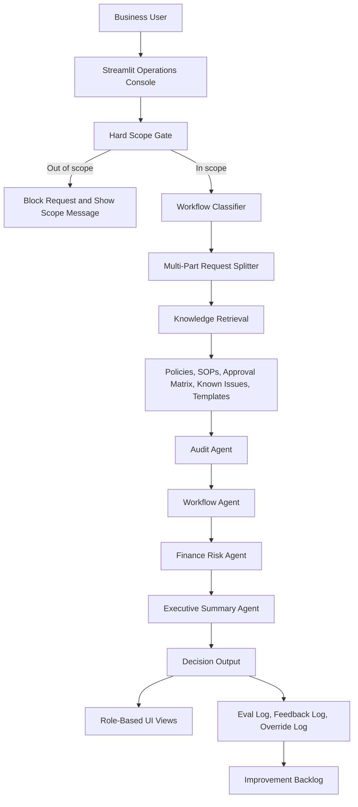
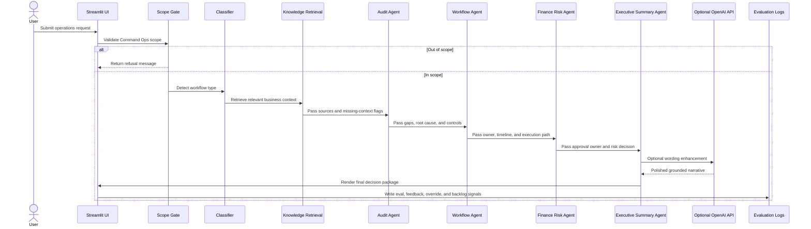
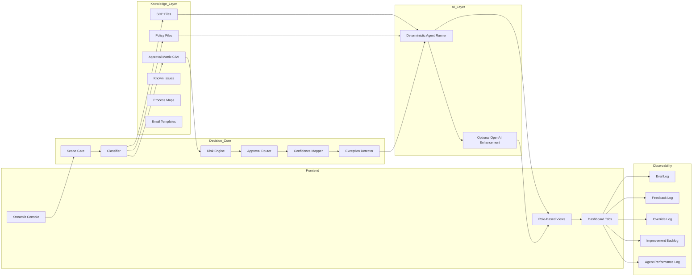

# Agent Maestro

## AI-Native Decision Intelligence Platform for Operations

Agent Maestro is a governed operations intelligence platform that converts messy business requests into structured, risk-scored, owner-aligned execution flows. It was designed as an AI decision layer for enterprise operations, especially refund escalations, billing issues, workflow ambiguity, audit requests, approval routing, and policy-driven exceptions.

The project demonstrates how AI can move beyond a chatbot interface and become an operational control layer. Instead of simply generating an answer, the system evaluates whether the request is in scope, classifies the work, retrieves relevant policy context, scores risk, assigns ownership, recommends the approval path, generates stakeholder communication, and logs quality signals for continuous improvement.

## Resume Summary

Built AI decision layer across 5 steps: intake, classification, risk scoring, ownership, and approval routing.

Modeled enterprise refund escalation, converting multi-team ambiguity into governed, risk-scored, owner-aligned execution flow.

## Core Purpose

Operations teams often receive work through unstructured channels: emails, tickets, Slack messages, spreadsheet notes, CRM comments, and escalation threads. A single request can involve customer impact, financial exposure, billing defects, login access, legal sensitivity, missing SOPs, approval thresholds, and audit evidence.

The purpose of Agent Maestro is to make that ambiguity executable.

It answers questions such as:

- What type of operational work is this?
- Is this request even in scope for the operations AI system?
- Which SOP, policy, approval matrix, or escalation rule applies?
- How risky is the request?
- Who should own the next action?
- What approval level is required?
- What should the team do next?
- What evidence should be logged?
- What did the AI system learn from this case?

## Business Problem

Before Agent Maestro, an enterprise refund escalation might look like this:

- A customer requests a refund in a support ticket.
- The issue also mentions duplicate billing and portal login failure.
- A support manager forwards it to billing.
- Billing asks finance whether approval is needed.
- Finance checks a policy manually.
- Legal may become involved if the customer uses sensitive language.
- Nobody is sure who owns the final routing.
- The same issue may be handled differently by different teams.
- The decision may not produce a strong audit trail.

This creates slow cycle time, inconsistent decisions, customer escalation risk, and weak governance.

Agent Maestro turns that unstructured situation into a governed decision flow.

## Product Thinking

The key product insight is that enterprise AI should not only produce text. It should help the business decide, route, approve, monitor, and improve.

Agent Maestro is built around five product principles:

1. Bound the AI system to a clear business domain.
2. Ground decisions in policy and SOP context.
3. Keep risk, approval, and ownership deterministic.
4. Use LLM enhancement only after business logic is established.
5. Capture evaluation signals so the system improves over time.

## Five-Step Decision Layer


### Step 1: Intake

The user submits a natural-language operations request. The request can be incomplete, informal, or multi-part.

Example:

```text
Customer asks for a $75,000 refund after duplicate billing, cannot access the billing portal, and says the issue caused serious business disruption.
```

The intake layer is intentionally simple because business users should not need to understand the underlying workflow model. The system should absorb ambiguity and structure it.

### Step 2: Classification

The classifier identifies the operational workflow type.

Supported workflows include:

- Refund Approval
- Billing Issue
- Billing Login
- Cash Application
- Collections
- Bad Debt
- Audit Request
- Missing Policy
- Workflow Issue
- Marketing Cloud
- AI Governance

Classification matters because every downstream action depends on knowing the type of work. Refund approval, billing login support, audit evidence, and AI governance require different policies, owners, controls, and escalation paths.

### Step 3: Risk Scoring

The risk layer evaluates business signals such as:

- Dollar amount
- Sensitive customer-impact language
- Missing policy context
- Conflicting SOPs
- Approval threshold
- Legal or regulatory language
- Customer escalation risk
- Financial exposure
- Confidence level

Risk scoring turns a text request into an operational decision signal.

Example:

```text
$75,000 refund + customer-impact claim + duplicate billing = Critical risk
```

### Step 4: Ownership Assignment

The ownership layer maps the request to the team or role responsible for the next action.

Example ownership rules:

| Condition | Likely Owner |
|---|---|
| Low-value refund with clear policy | Billing Operations |
| Medium-value refund | Finance Manager |
| High-value refund | Finance Director |
| Critical refund with legal language | VP Finance + Legal |
| Missing policy or unclear threshold | Operations Governance |
| Login access issue | Billing Support |
| Audit evidence request | Audit / Controls Owner |

Ownership assignment matters because many operational failures are not caused by lack of information. They are caused by unclear handoffs.

### Step 5: Approval Routing

The approval routing layer checks the amount, workflow type, and risk level against the approval matrix.

The system produces:

- Required approver
- Escalation path
- Governance notes
- Manual review requirement
- Fallback guidance if context is missing

Approval routing is intentionally rule-based so the core business decision remains explainable and auditable.

## End-to-End Flow



## Agent Architecture

Agent Maestro uses a multi-agent operating pattern. The implementation keeps deterministic business logic at the center and can optionally enhance language quality with the OpenAI API.

### Agent Roles

| Agent | Purpose | Input | Output |
|---|---|---|---|
| Knowledge Agent | Retrieve SOP, policy, process, and known-issue context | Request type and user request | Relevant snippets, source list, missing context flags |
| Audit Agent | Identify gaps, control issues, and root cause | User request + retrieved context | Audit findings, gaps, automation opportunities |
| Workflow Agent | Convert findings into execution steps | Audit output + approval data | Owner, timeline, dependencies, escalation path |
| Finance Risk Agent | Evaluate financial risk and approvals | Workflow output + approval matrix | Risk level, approval owner, governance note |
| Executive Summary Agent | Create leadership-ready summary | All prior outputs | Summary, recommendation, stakeholder communication |

## Sequence Diagram



## System Architecture



## API Design

The current project is implemented as a Streamlit application with Python functions as the internal service layer. In an enterprise deployment, these functions can be exposed as REST APIs or internal service endpoints. The API design below explains the system boundaries and how each decision step would be operationalized.

### 1. Submit Operations Request

```http
POST /api/v1/requests
```

Purpose:

Accept a raw business request and create a decision run.

Request body:

```json
{
  "request_text": "Customer asks for a $75,000 refund after duplicate billing and login failure.",
  "submitted_by": "ops.analyst@company.com",
  "source_channel": "support_ticket",
  "customer_id": "CUST-10492",
  "ticket_id": "TCK-83721"
}
```

Response body:

```json
{
  "decision_run_id": "run_20260707_001",
  "status": "accepted",
  "next_step": "scope_check"
}
```

Why this API exists:

It separates request intake from decision execution. In a real company, requests may come from Salesforce, Zendesk, Slack, email, ServiceNow, or an internal portal. This API gives every channel one controlled entry point.

### 2. Scope Check

```http
POST /api/v1/requests/{decision_run_id}/scope-check
```

Purpose:

Determine whether the request belongs to the supported operations domain.

Response body:

```json
{
  "in_scope": true,
  "scope": "Command Ops",
  "matched_keywords": ["refund", "duplicate billing", "login"],
  "blocked_reason": null
}
```

Why this API exists:

Enterprise AI systems need domain boundaries. The scope gate prevents the platform from becoming a general chatbot and avoids sending unrelated prompts into retrieval or LLM layers.

### 3. Classify Request

```http
POST /api/v1/requests/{decision_run_id}/classify
```

Purpose:

Classify the request into the best supported workflow type.

Response body:

```json
{
  "workflow_type": "Refund Approval",
  "confidence": 0.91,
  "matched_reasons": [
    "refund",
    "duplicate billing",
    "detected amount $75,000.00"
  ],
  "secondary_workflows": [
    "Billing Issue",
    "Billing Login"
  ]
}
```

Why this API exists:

Classification is the pivot point for policy retrieval, ownership, risk logic, and approval routing. It also makes the AI decision explainable because the system can show why a workflow type was chosen.

### 4. Retrieve Knowledge Context

```http
POST /api/v1/requests/{decision_run_id}/knowledge
```

Purpose:

Retrieve SOPs, policies, known issues, process maps, approval data, and communication templates relevant to the classified workflow.

Response body:

```json
{
  "sources": [
    "data/sample_sops/refund_policy.md",
    "data/approval_matrix.csv",
    "permissionagent/policies/refund_policy_global.md",
    "permissionagent/process_maps/refund_process_future_state.md"
  ],
  "snippets": [
    "Refunds above threshold require Finance Director review.",
    "Duplicate billing requires billing validation before refund execution."
  ],
  "missing_context": false,
  "contradictions": [],
  "policy_versions": [
    {
      "name": "Refund Policy Global",
      "version": "v3.2",
      "updated": "2026-01"
    }
  ]
}
```

Why this API exists:

The system should not make enterprise decisions from generic model knowledge alone. This API creates the evidence packet used by downstream agents and reviewers.

### 5. Score Risk

```http
POST /api/v1/requests/{decision_run_id}/risk-score
```

Purpose:

Evaluate financial, customer, policy, and governance risk.

Response body:

```json
{
  "risk_level": "Critical",
  "risk_score": 96,
  "risk_drivers": [
    "High refund amount",
    "Duplicate billing",
    "Customer-impact language",
    "Multi-team dependency"
  ],
  "confidence": 0.86,
  "required_action": "Manual escalation before execution"
}
```

Why this API exists:

Risk scoring turns unstructured text into a decision signal. It gives managers a consistent way to compare operational work and decide whether automation, manager validation, or executive escalation is appropriate.

### 6. Assign Owner

```http
POST /api/v1/requests/{decision_run_id}/owner
```

Purpose:

Assign the accountable team or role for next action.

Response body:

```json
{
  "primary_owner": "Finance Director",
  "supporting_owners": [
    "Billing Operations",
    "Customer Support",
    "Legal"
  ],
  "reason": "Refund amount exceeds standard operations threshold and includes customer-impact language."
}
```

Why this API exists:

Operational ambiguity often comes from unclear ownership. This API makes accountability explicit and reduces handoff delays.

### 7. Route Approval

```http
POST /api/v1/requests/{decision_run_id}/approval-route
```

Purpose:

Determine the required approval path based on workflow, amount, risk, and policy context.

Response body:

```json
{
  "approval_required": true,
  "approval_owner": "VP Finance + Legal",
  "approval_reason": "Critical refund exposure with sensitive customer-impact claim.",
  "pre_approval_checks": [
    "Validate duplicate billing evidence",
    "Confirm billing portal login issue",
    "Check refund eligibility",
    "Document customer communication"
  ],
  "fallback": "If evidence is incomplete, place case in manual review queue."
}
```

Why this API exists:

Approval routing is where the decision layer becomes executable. It tells the business exactly who must approve, what must be checked, and what should happen if evidence is incomplete.

### 8. Generate Decision Package

```http
POST /api/v1/requests/{decision_run_id}/decision-package
```

Purpose:

Generate the complete response for the operations team.

Response body:

```json
{
  "summary": "Critical refund escalation requiring Finance and Legal review.",
  "workflow_steps": [
    "Validate duplicate billing evidence.",
    "Confirm portal access failure.",
    "Check refund policy eligibility.",
    "Escalate to VP Finance and Legal.",
    "Prepare customer-facing response after approval."
  ],
  "risk_note": "High financial exposure and sensitive customer-impact language require manual escalation.",
  "email_draft": "Hi team, this case requires Finance and Legal review before refund execution...",
  "sources_used": [
    "refund_policy.md",
    "approval_matrix.csv"
  ]
}
```

Why this API exists:

The decision package is the business-facing artifact. It combines workflow, risk, approval, evidence, and communication into one usable output.

### 9. Log Evaluation Signal

```http
POST /api/v1/evaluations
```

Purpose:

Capture quality, confidence, overrides, feedback, and improvement signals.

Request body:

```json
{
  "decision_run_id": "run_20260707_001",
  "workflow_type": "Refund Approval",
  "risk_level": "Critical",
  "confidence": 0.86,
  "human_feedback": "Correct approval route, but add customer success owner.",
  "override_applied": false,
  "missing_context": false
}
```

Response body:

```json
{
  "logged": true,
  "improvement_backlog_created": true,
  "backlog_reason": "New owner suggestion captured"
}
```

Why this API exists:

AI systems need operational memory. This endpoint turns individual decisions into learning signals for policy updates, workflow improvements, and governance review.

## Data Model

### Decision Run

| Field | Meaning |
|---|---|
| decision_run_id | Unique ID for the decision event |
| request_text | Original user request |
| workflow_type | Classified operational workflow |
| confidence | Confidence in classification and final recommendation |
| risk_level | Low, Medium, High, or Critical |
| primary_owner | Accountable role/team |
| approval_owner | Required approver |
| sources_used | SOPs, policies, and matrices used |
| missing_context | Whether required evidence was missing |
| contradictions | Policy or SOP conflicts found |
| final_recommendation | Generated decision package |

### Knowledge Source

| Field | Meaning |
|---|---|
| source_path | File or connector source |
| source_type | SOP, policy, matrix, process map, template, known issue |
| version | Policy or document version |
| updated_at | Last update signal |
| snippet | Relevant extracted context |
| confidence | Retrieval relevance score |

### Evaluation Event

| Field | Meaning |
|---|---|
| decision_run_id | Related decision |
| user_feedback | Human feedback |
| override_reason | Why human changed the AI recommendation |
| quality_score | Manual or automated quality signal |
| agent_failure | Which agent failed, if any |
| backlog_item | Process or policy improvement generated |

## Refund Escalation Example

### Input

```text
Customer asks for a $75,000 refund after duplicate billing, cannot access the billing portal, and says the issue caused serious business disruption.
```

### System Interpretation

| Dimension | Result |
|---|---|
| Scope | In scope: Command Ops |
| Primary workflow | Refund Approval |
| Secondary workflows | Billing Issue, Billing Login |
| Amount | $75,000 |
| Risk | Critical |
| Owner | VP Finance + Legal |
| Supporting teams | Billing Operations, Customer Support |
| Approval path | Executive approval before execution |
| Required checks | Billing validation, refund eligibility, portal access issue, customer communication |

### Why This Is a Strong Example

This case shows the difference between a chatbot and a decision layer. A chatbot might draft a refund response. Agent Maestro identifies that the request is actually a multi-team operational escalation with financial exposure, customer risk, approval requirements, policy dependency, and governance implications.

## Governance Controls

Agent Maestro includes governance controls that make the system safer for enterprise use:

- Hard scope gate before retrieval or LLM use
- Local policy and SOP grounding
- Approval matrix lookup
- Confidence-to-action mapping
- Exception detection
- Missing-context flags
- Policy source traceability
- Human feedback logging
- Decision override tracking
- Improvement backlog generation
- Role-based views for Analyst, Manager, and Director users

## Why Each Step Matters

| Step | Why It Matters |
|---|---|
| Intake | Captures messy real-world requests without forcing users into rigid forms |
| Scope gate | Keeps AI focused on approved business domain |
| Classification | Chooses the right operational workflow |
| Knowledge retrieval | Grounds the answer in company policy |
| Risk scoring | Converts text into a decision signal |
| Ownership assignment | Removes ambiguity around accountability |
| Approval routing | Ensures financial and customer-impact controls are followed |
| Decision package | Gives the team an executable workflow |
| Logging | Creates observability and continuous improvement |

## Enterprise Integrations

In a larger deployment, Agent Maestro could connect to:

| System | Integration Purpose |
|---|---|
| Salesforce | Pull account, case, opportunity, and billing context |
| Zendesk | Ingest support tickets and customer conversation history |
| Slack or Teams | Accept escalation requests and send routing updates |
| ServiceNow | Create workflow tasks and approval requests |
| NetSuite or ERP | Validate invoices, credits, and payments |
| Stripe or billing system | Confirm duplicate charges and refund status |
| Confluence or SharePoint | Retrieve SOPs and policy documents |
| Data warehouse | Track cycle time, cost, volume, and ROI metrics |

## MCP Connector Thinking

Model Context Protocol connectors would allow Agent Maestro to securely access enterprise systems while keeping the AI workflow modular.

Potential MCP tools:

| MCP Tool | Purpose |
|---|---|
| `salesforce.search_cases` | Retrieve customer case history |
| `zendesk.get_ticket` | Load ticket details and conversation thread |
| `billing.lookup_invoice` | Validate invoice, payment, and duplicate charge evidence |
| `policy.search_docs` | Retrieve SOP and policy context |
| `approval.get_matrix` | Fetch current approval thresholds |
| `slack.post_update` | Notify owner or escalation channel |
| `servicenow.create_task` | Create execution or approval task |
| `governance.log_decision` | Store decision trace and override signals |

The design principle is that the agent should reason across tools, but the actual business actions should remain governed, logged, and permissioned.

## Value Metrics

Agent Maestro can be evaluated through operational metrics:

- Intake-to-routing time
- Manual SOP lookup time saved
- Approval routing accuracy
- Escalation cycle time
- First-pass resolution rate
- Number of missing-context cases
- Number of policy contradictions found
- Human override rate
- Risk detection accuracy
- Customer-impact escalation reduction
- Analyst productivity improvement
- Audit readiness improvement

## Interview Explanation

If asked to explain this project in an interview:

```text
Agent Maestro is an AI-native operations decision layer. I built it to show how enterprise AI can move from answering questions to governing real work. A user submits a messy operational issue, such as a refund escalation. The system checks scope, classifies the workflow, retrieves SOP and policy context, scores risk, assigns ownership, routes approval, generates an execution plan, and logs evaluation signals. The main idea is that AI should not replace business controls. It should make those controls faster, clearer, and more measurable.
```

## Technical Skills Demonstrated

- Streamlit application design
- Python orchestration logic
- Multi-agent workflow modeling
- Retrieval from local SOP and policy files
- Deterministic risk and approval rules
- Optional OpenAI API response enhancement
- CSV-based evaluation logging
- Business process modeling
- Governance and auditability design
- API contract thinking
- Enterprise integration architecture
- Human-in-the-loop AI design

