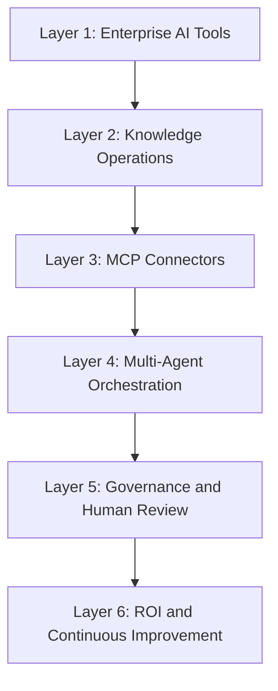
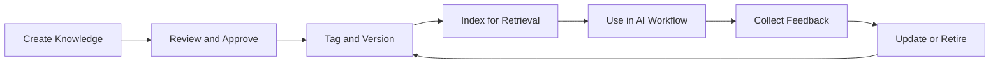
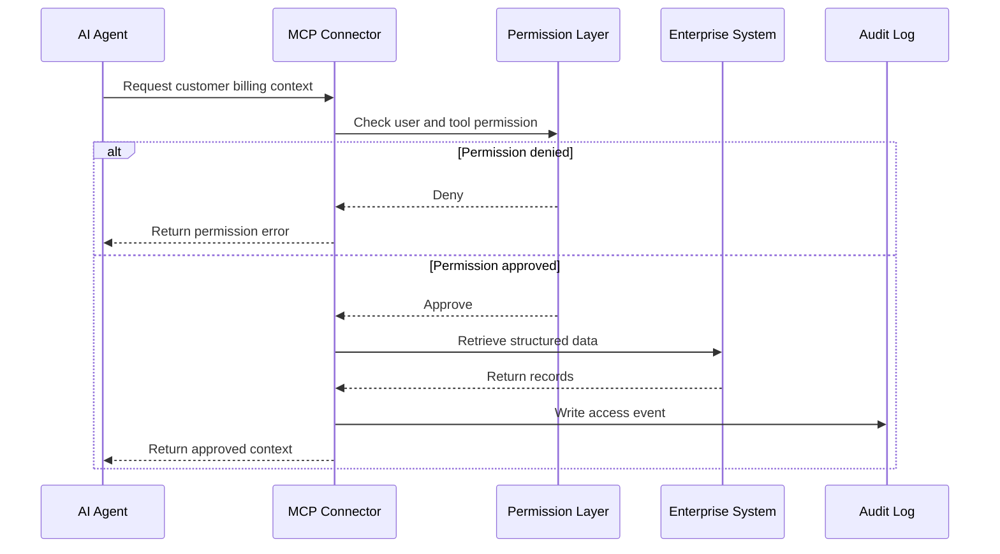
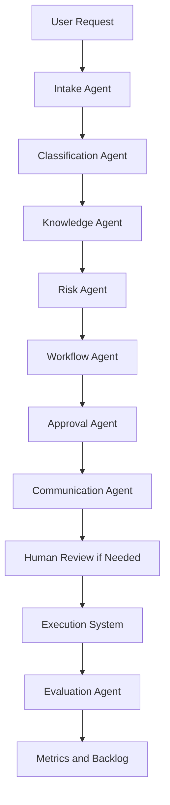
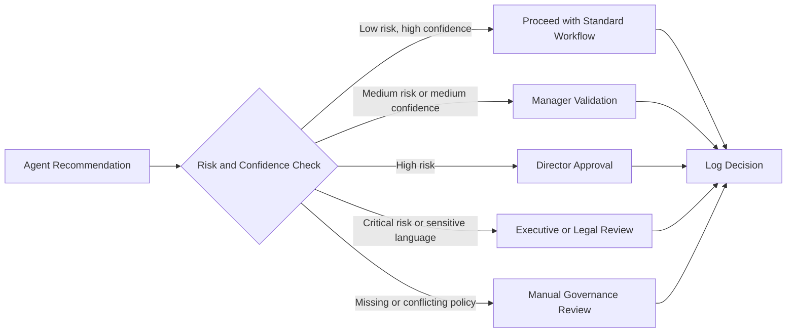
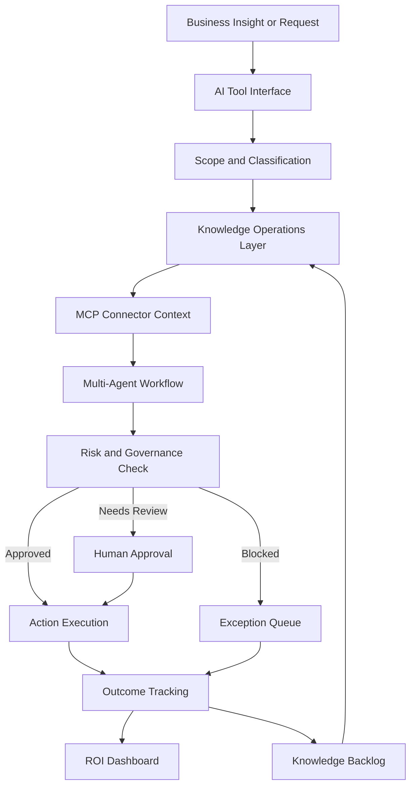
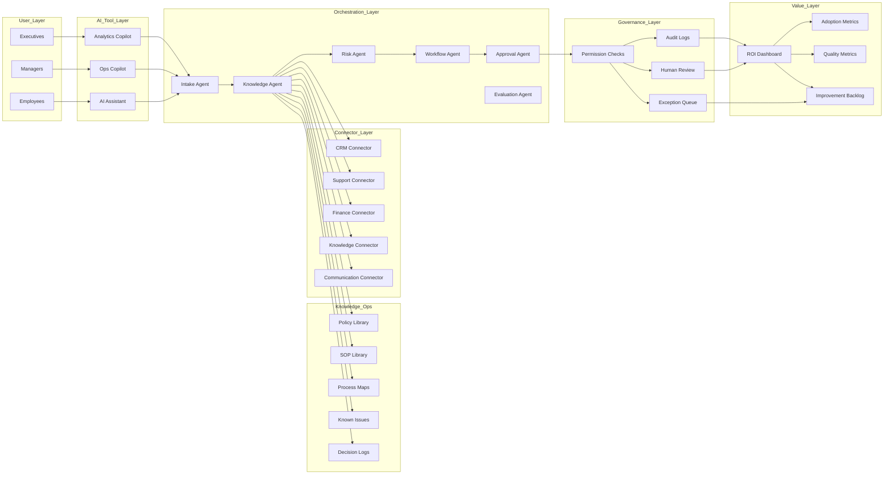

# Insight-to-Execution Operating Model

## Knowledge Operations, MCP Connectors, and Multi-Agent Workflow Strategy

The Insight-to-Execution Operating Model is a strategy project that defines how an enterprise can convert scattered knowledge, AI tools, connectors, governance rules, and business metrics into a repeatable operating system for AI-driven work.

It is not a single chatbot or one automation script. It is a six-layer operating model for turning business insight into governed execution.

## Resume Summary

Designed 6-layer operating model linking enterprise AI tools, knowledge operations, connectors, orchestration, governance, and ROI.

Defined 12 value metrics across cycle time, cost, adoption, governance exceptions, productivity, quality, and profitability.

## Core Purpose

Many organizations adopt AI tools before they have an operating model. They buy assistants, copilots, workflow automation tools, knowledge bases, and analytics platforms, but the pieces do not naturally connect.

This creates a gap between insight and execution.

The purpose of this project is to define the missing operating model:

- How knowledge is prepared for AI use
- How AI tools connect to enterprise systems
- How multi-agent workflows coordinate work
- How governance controls are enforced
- How humans approve sensitive actions
- How ROI is measured
- How the system improves over time

## Strategic Problem

Enterprise AI efforts often fail to scale because they focus on tools instead of operating design.

Common problems include:

- Knowledge is scattered across documents, tickets, Slack threads, dashboards, and tribal memory.
- AI tools do not know which source is authoritative.
- Teams use different assistants without shared governance.
- Connectors exist, but workflows are not clearly designed.
- Agents can summarize information but cannot reliably move work forward.
- Business leaders cannot see ROI.
- Risk, approval, and human review are handled manually or inconsistently.

The Insight-to-Execution Operating Model solves this by defining a structured path from business question to governed action.

## Six-Layer Operating Model



## Layer 1: Enterprise AI Tools

### Purpose

This layer defines the AI tools employees use to ask questions, generate work, analyze information, and interact with enterprise workflows.

Examples:

- ChatGPT Enterprise
- Microsoft Copilot
- Internal AI assistant
- Workflow copilots
- Analytics assistants
- Operations decision agents
- Customer support copilots

### Thinking Behind the Layer

AI tools are the user-facing surface, but they are not the operating model by themselves. Without connected knowledge, governance, and workflow orchestration, the tool becomes a smart interface with limited business reliability.

The design principle is:

```text
AI tools should be the front door, not the whole building.
```

### Key Design Questions

- Who is the user?
- What work should the AI tool support?
- Which actions should it be allowed to take?
- Which actions require human approval?
- Which knowledge sources should it trust?
- What business outcome should it improve?

## Layer 2: Knowledge Operations

### Purpose

Knowledge Operations prepares enterprise knowledge so AI systems can retrieve, trust, and apply it.

This includes:

- SOPs
- Policies
- Approval matrices
- Process maps
- Email templates
- Historical tickets
- Known issues
- FAQs
- Product documentation
- Governance rules
- Decision logs

### Thinking Behind the Layer

AI quality depends heavily on knowledge quality. If enterprise knowledge is outdated, duplicated, contradictory, or unowned, AI will amplify those weaknesses.

Knowledge Operations answers:

- What is the source of truth?
- Who owns each knowledge source?
- How often is it updated?
- Which documents are approved for AI retrieval?
- Which policies are outdated or conflicting?
- What metadata is required?

### Knowledge Lifecycle



### Knowledge Metadata

Every knowledge source should include:

| Metadata | Purpose |
|---|---|
| Owner | Establishes accountability |
| Version | Supports auditability |
| Updated date | Helps detect stale sources |
| Approved use | Defines whether AI can use it |
| Sensitivity | Controls access and redaction |
| Business domain | Improves retrieval relevance |
| Expiration date | Prevents outdated guidance |
| Source system | Enables traceability |

## Layer 3: MCP Connectors

### Purpose

MCP connectors provide secure, structured access between AI agents and enterprise systems.

Instead of copying data into prompts manually, connectors allow agents to retrieve relevant context and trigger permissioned actions through defined tools.

### Example Connector Categories

| Connector Category | Example Systems | Purpose |
|---|---|---|
| CRM | Salesforce, HubSpot | Customer and account context |
| Support | Zendesk, ServiceNow | Tickets, cases, incidents |
| Finance | NetSuite, Stripe, billing system | Invoices, refunds, payments |
| Knowledge | Confluence, SharePoint, Google Drive | SOP and policy retrieval |
| Communication | Slack, Teams, Gmail | Escalation updates and drafts |
| Analytics | Snowflake, BigQuery, Tableau | KPI and trend analysis |
| Governance | GRC platform, audit system | Decision logs and controls |

### Thinking Behind the Layer

AI agents need context, but access must be controlled. MCP connectors create a clean boundary:

- The model can request context.
- The connector enforces permissions.
- The action is logged.
- Sensitive operations require approval.
- Tool outputs are structured and auditable.

### MCP Connector Flow



## Layer 4: Multi-Agent Orchestration

### Purpose

Multi-agent orchestration coordinates specialized agents so work can move from insight to execution.

Instead of one general assistant doing everything, each agent has a specific role.

### Example Agent Roles

| Agent | Responsibility |
|---|---|
| Intake Agent | Understand the user request and extract key facts |
| Classification Agent | Determine workflow type and business domain |
| Knowledge Agent | Retrieve relevant SOPs, policies, and context |
| Risk Agent | Score financial, operational, legal, and customer risk |
| Workflow Agent | Generate execution steps and dependencies |
| Approval Agent | Determine required approver and routing |
| Communication Agent | Draft stakeholder updates |
| Evaluation Agent | Log quality, feedback, and improvement signals |

### Thinking Behind the Layer

Different parts of work require different logic. Classification, retrieval, risk scoring, approval routing, communication, and evaluation should not be blurred into one opaque response.

The design principle is:

```text
Separate reasoning responsibilities so the system is easier to test, govern, and improve.
```

### Orchestration Flow



## Layer 5: Governance and Human Review

### Purpose

Governance defines how the organization keeps AI-assisted work safe, compliant, auditable, and aligned with business controls.

### Governance Controls

- Scope boundaries
- Role-based access
- Connector permissions
- Data sensitivity classification
- Policy source traceability
- Human-in-the-loop approval
- Decision override logging
- Prompt and response evaluation
- Exception handling
- Audit logs
- Model usage monitoring
- Quality review

### Thinking Behind the Layer

AI systems should not bypass business controls. They should make controls easier to apply.

Human review is required when:

- Risk is high or critical
- Confidence is low
- Policy context is missing
- Sources conflict
- Customer-impact language appears
- Financial exposure exceeds threshold
- Legal or regulatory language appears
- The agent wants to take an external action

### Governance Flow



## Layer 6: ROI and Continuous Improvement

### Purpose

The final layer measures whether the AI operating model is creating business value.

AI value should not be measured only by usage. Usage is helpful, but not enough. The system must connect activity to outcomes.

### Thinking Behind the Layer

The operating model should answer:

- Are requests handled faster?
- Are teams spending less time searching for information?
- Are approvals routed more accurately?
- Are exceptions detected earlier?
- Are employees adopting the tool?
- Are customers receiving better responses?
- Are governance risks decreasing?
- Is the organization learning from repeated issues?

## Twelve Value Metrics

| Metric | Category | What It Measures |
|---|---|---|
| Intake-to-routing time | Cycle time | Time from request submission to owner assignment |
| Resolution cycle time | Cycle time | Time from request to completed action |
| Manual lookup time saved | Productivity | Reduction in SOP, policy, or ticket search time |
| Analyst throughput | Productivity | Number of cases handled per analyst |
| Cost per case | Cost | Labor and tool cost to resolve a request |
| Escalation rate | Quality | Percentage of cases requiring escalation |
| Approval accuracy | Governance | Correctness of approval routing |
| Governance exception rate | Governance | Missing context, policy conflict, or manual review triggers |
| Human override rate | Quality | How often humans change AI recommendations |
| Adoption rate | Adoption | Active users and repeat usage by team |
| First-pass quality | Quality | Recommendations accepted without rework |
| Profitability impact | Profitability | Savings, avoided leakage, reduced refunds, or faster revenue operations |

## Insight-to-Execution API Strategy

The APIs below describe how the operating model could be implemented across enterprise systems. They are intentionally modular so each layer can evolve independently.

### 1. Submit Insight

```http
POST /api/v1/insights
```

Purpose:

Capture a business observation, request, issue, or opportunity.

Request body:

```json
{
  "text": "Refund escalations above $50K are taking too long because ownership is unclear.",
  "source": "ops_leader",
  "business_domain": "finance_operations",
  "priority": "high"
}
```

Response body:

```json
{
  "insight_id": "ins_001",
  "status": "captured",
  "next_step": "classify"
}
```

Why this API exists:

It creates a single front door for ideas, issues, and improvement signals. This is how scattered observations become structured operating data.

### 2. Classify Insight

```http
POST /api/v1/insights/{insight_id}/classify
```

Purpose:

Determine whether the insight is a process issue, risk issue, automation opportunity, knowledge gap, governance gap, or ROI opportunity.

Response body:

```json
{
  "classification": "workflow_ambiguity",
  "secondary_classifications": [
    "approval_delay",
    "ownership_gap"
  ],
  "confidence": 0.88
}
```

Why this API exists:

Classification converts raw insight into a management action category.

### 3. Search Knowledge

```http
POST /api/v1/knowledge/search
```

Purpose:

Retrieve relevant enterprise knowledge with ownership, version, and source traceability.

Request body:

```json
{
  "query": "refund escalation ownership threshold above $50K",
  "domains": ["finance_operations", "customer_support"],
  "approved_for_ai": true
}
```

Response body:

```json
{
  "results": [
    {
      "title": "Refund Approval Matrix",
      "source": "SharePoint",
      "owner": "Finance Operations",
      "version": "FY27",
      "updated_at": "2026-02-14",
      "snippet": "Refunds above $50K require Finance Director review."
    }
  ]
}
```

Why this API exists:

It prevents agents from relying on unverified or stale knowledge.

### 4. Connector Context Request

```http
POST /api/v1/connectors/context
```

Purpose:

Request structured context from enterprise systems through permissioned connectors.

Request body:

```json
{
  "connector": "salesforce",
  "tool": "search_cases",
  "parameters": {
    "account_id": "A-10042",
    "case_type": "refund"
  },
  "requested_by": "agent:knowledge"
}
```

Response body:

```json
{
  "approved": true,
  "records": [
    {
      "case_id": "500xx001",
      "status": "open",
      "summary": "Duplicate billing escalation"
    }
  ],
  "audit_event_id": "audit_7781"
}
```

Why this API exists:

It gives agents access to live business systems without uncontrolled data exposure.

### 5. Orchestrate Workflow

```http
POST /api/v1/orchestration/runs
```

Purpose:

Start a multi-agent workflow for an insight or request.

Request body:

```json
{
  "insight_id": "ins_001",
  "workflow": "refund_escalation_improvement",
  "agents": [
    "intake",
    "knowledge",
    "risk",
    "workflow",
    "approval",
    "evaluation"
  ]
}
```

Response body:

```json
{
  "run_id": "orch_991",
  "status": "running",
  "current_agent": "intake"
}
```

Why this API exists:

It separates workflow coordination from individual agents. This makes orchestration observable, resumable, and testable.

### 6. Governance Decision

```http
POST /api/v1/governance/decision
```

Purpose:

Determine whether the agent recommendation can proceed, needs review, or must be blocked.

Request body:

```json
{
  "run_id": "orch_991",
  "risk_level": "high",
  "confidence": 0.76,
  "action_type": "approval_route_change",
  "data_sensitivity": "internal"
}
```

Response body:

```json
{
  "decision": "requires_director_review",
  "reason": "High risk and workflow policy change",
  "required_approver": "Director, Finance Operations"
}
```

Why this API exists:

It prevents agents from silently executing sensitive actions and creates a consistent review policy.

### 7. Execute Action

```http
POST /api/v1/actions
```

Purpose:

Create a task, send a draft, update a record, or trigger a workflow after governance approval.

Request body:

```json
{
  "run_id": "orch_991",
  "action_type": "create_servicenow_task",
  "approved_by": "director@company.com",
  "payload": {
    "title": "Update refund escalation ownership rule",
    "owner": "Finance Operations",
    "due_date": "2026-07-21"
  }
}
```

Response body:

```json
{
  "action_id": "act_442",
  "status": "created",
  "external_record": "SNOW-102938"
}
```

Why this API exists:

Execution must be separated from recommendation. This allows the organization to control what the AI can do and what requires approval.

### 8. Measure Value

```http
POST /api/v1/metrics/value-event
```

Purpose:

Capture value signals tied to a workflow run.

Request body:

```json
{
  "run_id": "orch_991",
  "metric": "intake_to_routing_time",
  "baseline_value": 48,
  "actual_value": 6,
  "unit": "hours"
}
```

Response body:

```json
{
  "recorded": true,
  "estimated_hours_saved": 42
}
```

Why this API exists:

AI ROI requires measurement at the workflow level, not just usage dashboards.

## Full Operating Model Flow



## Architecture Diagram



## Example Use Case: Refund Escalation Operating Improvement

### Business Insight

```text
High-value refund escalations take too long because the approval owner is unclear when a case involves duplicate billing, customer impact, and login failure.
```

### Operating Model Response

| Layer | Action |
|---|---|
| AI tools | User submits insight through operations assistant |
| Knowledge ops | System retrieves refund policy, approval matrix, process map, known issues |
| MCP connectors | Pulls ticket volume, case examples, invoice context, and escalation history |
| Orchestration | Agents classify issue, identify ownership gap, calculate risk, propose workflow update |
| Governance | Director reviews recommended approval route change |
| ROI | Dashboard tracks cycle time reduction, escalation reduction, and approval accuracy |

### Output

The operating model produces:

- A clear refund escalation workflow
- Updated owner mapping
- Approval threshold logic
- Governance review requirement
- ServiceNow task for process update
- Knowledge backlog item for SOP revision
- ROI tracking for cycle time and case cost

## Why Each Layer Matters

| Layer | Why It Matters |
|---|---|
| Enterprise AI Tools | Gives employees a simple interface to ask, analyze, and act |
| Knowledge Operations | Makes enterprise knowledge usable and trustworthy for AI |
| MCP Connectors | Lets agents access live systems through governed boundaries |
| Multi-Agent Orchestration | Breaks complex work into specialized, testable roles |
| Governance | Keeps sensitive actions controlled and auditable |
| ROI | Proves whether AI is creating measurable business value |

## Implementation Roadmap

### Phase 1: Foundation

- Identify high-value workflows
- Map source systems
- Define knowledge owners
- Create policy and SOP metadata standard
- Define governance thresholds
- Build first workflow prototype

### Phase 2: Connector Enablement

- Add CRM connector
- Add support ticket connector
- Add knowledge base connector
- Add finance or billing connector
- Add communication connector
- Implement connector audit logging

### Phase 3: Agent Orchestration

- Define agent roles
- Build workflow templates
- Add risk scoring
- Add approval routing
- Add human review queue
- Add exception handling

### Phase 4: Measurement

- Establish baseline metrics
- Track cycle time
- Track cost per case
- Track adoption
- Track override rate
- Track governance exceptions
- Build ROI dashboard

### Phase 5: Scale

- Add more workflows
- Expand connector coverage
- Improve knowledge lifecycle
- Automate more low-risk actions
- Use evaluation data to improve prompts, policies, and workflows

## Operating Principles

1. Start with business workflow, not model capability.
2. Treat knowledge as an operational asset.
3. Connect AI to systems through permissioned tools.
4. Separate recommendation from execution.
5. Require human review for high-risk decisions.
6. Log every meaningful decision and override.
7. Measure value at the workflow level.
8. Use feedback to improve process, policy, and agent behavior.

## Interview Explanation

If asked to explain this project in an interview:

```text
I designed an Insight-to-Execution Operating Model for enterprise AI. The idea is that AI value does not come from a chatbot alone. It comes from connecting AI tools to clean knowledge, secure connectors, multi-agent workflows, governance controls, and ROI measurement. I structured the model into six layers: enterprise AI tools, knowledge operations, MCP connectors, orchestration, governance, and ROI. I also defined value metrics such as cycle time, cost per case, adoption, governance exceptions, quality, productivity, and profitability. This shows how I think about AI as an operating system for business execution, not just a productivity tool.
```

## Skills Demonstrated

- Enterprise AI strategy
- Knowledge operations design
- MCP connector architecture
- Multi-agent workflow strategy
- Governance and human-in-the-loop design
- API contract design
- Business process transformation
- ROI framework development
- Operational analytics
- Cross-functional workflow design
- Executive communication
- AI adoption and change-management thinking

