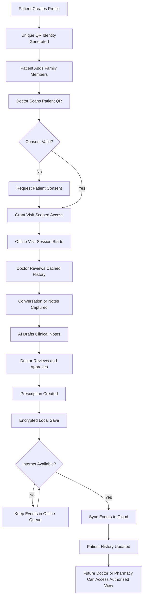
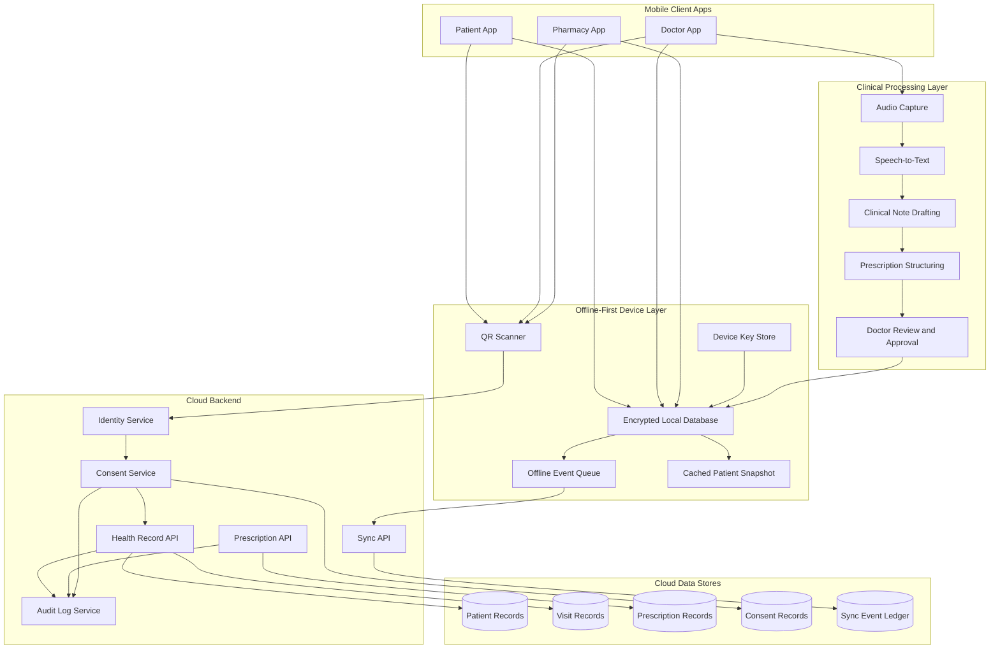
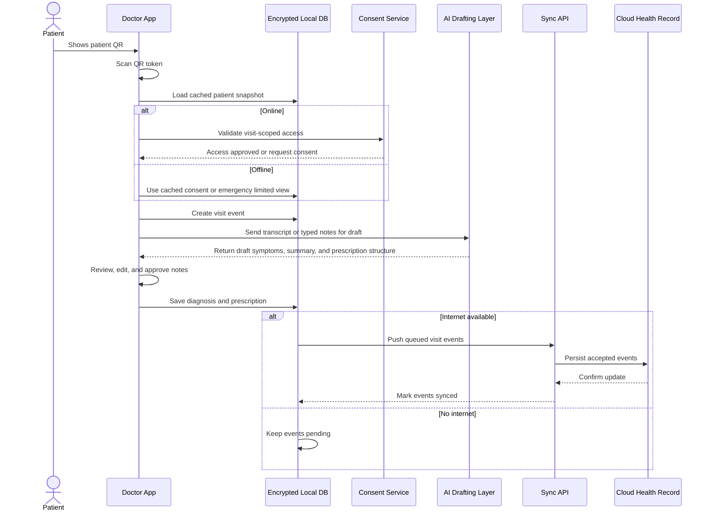
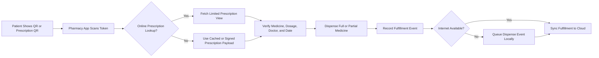
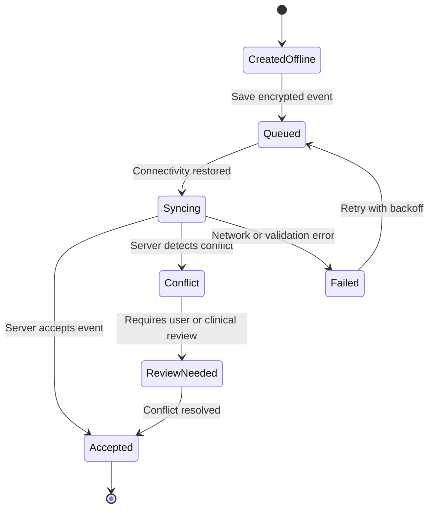
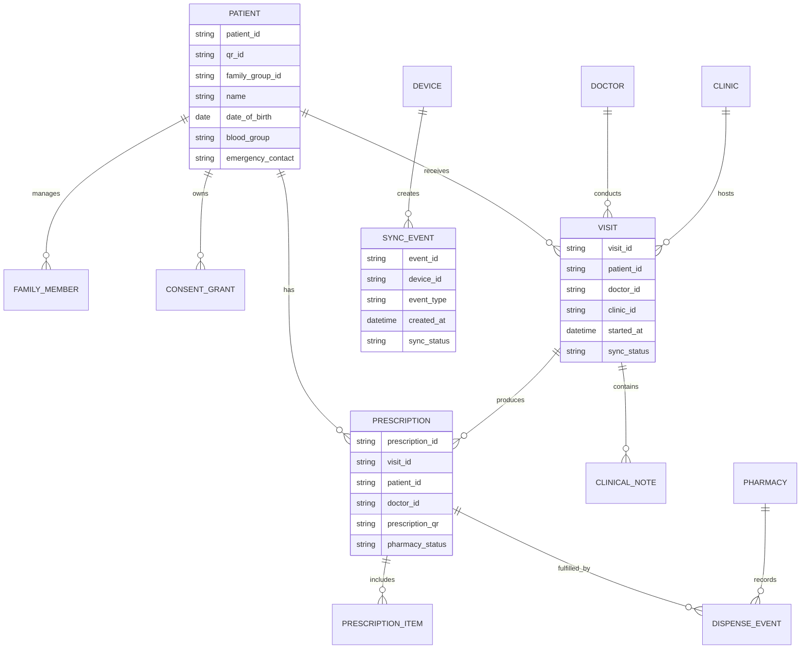
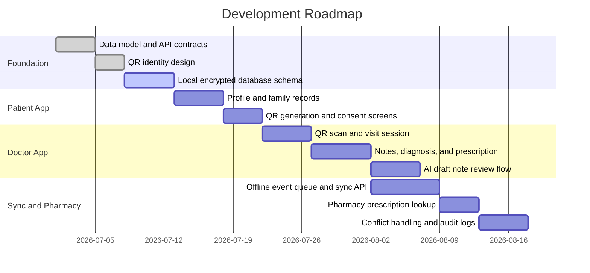
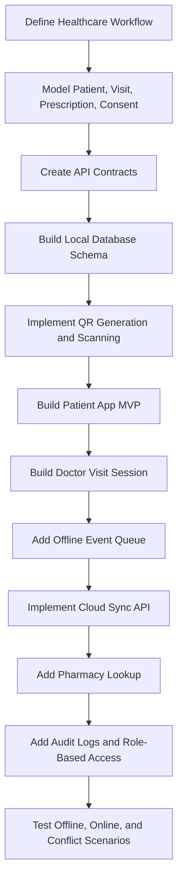

# Offline-First Health Record QR Platform

## Mobile Health Records for Low-Connectivity Communities

This project is an offline-first healthcare record platform for communities where internet access is unreliable but smartphones are increasingly common. The platform gives every patient a portable QR-based health identity so doctors, clinics, and pharmacies can access the right medical context at the point of care, even when the device is offline.

The system is designed for rural clinics, health camps, developing regions, and low-resource environments where medical history is often fragmented across paper prescriptions, patient memory, and disconnected providers. Instead of assuming a stable cloud connection, the platform keeps encrypted records on the device, captures clinical events locally, and synchronizes them when connectivity returns.

## Resume-Ready Summary

Designed an offline-first mobile healthcare record platform using QR-based patient identity, encrypted local storage, doctor visit sessions, AI-assisted clinical note drafting, structured prescriptions, pharmacy verification, consent controls, and automatic cloud synchronization for low-connectivity regions.

Modeled a multi-role healthcare workflow where patients, doctors, pharmacists, clinics, and family caregivers can exchange medical context securely without depending on continuous internet access.

## Project Justification

The project is justified by a real healthcare infrastructure gap: the patient often moves between doctors, clinics, pharmacies, and villages, but the medical record does not move with them.

In many low-connectivity regions:

- Patients lose paper prescriptions or forget medicine names.
- Doctors cannot reliably see past diagnoses, allergies, chronic conditions, or dosage history.
- Pharmacies may dispense medication without structured verification.
- One smartphone may need to support records for an entire family.
- Cloud-only systems fail during the exact moment the doctor needs the record.
- Rural clinics and mobile health camps may operate without stable connectivity.

This platform addresses that gap by making the patient the carrier of a secure health identity while keeping clinical data protected, synchronized, and auditable.

## Problem

Healthcare delivery becomes riskier when medical history is missing. A doctor may need to make decisions without knowing:

- Previous symptoms
- Diagnoses
- Prescribed medicines
- Dosage instructions
- Allergies
- Chronic conditions
- Lab reports
- Family medical history
- Follow-up advice
- Doctor notes

This causes several downstream problems:

- Doctors repeat the same intake questions every visit.
- Patients misremember medication names or dosage.
- Paper prescriptions are lost, damaged, or hard to read.
- Pharmacies cannot verify what was prescribed.
- Emergency care lacks critical context.
- Family members struggle to manage care for children and elderly parents.
- Clinics cannot depend on cloud-only applications.

The platform solves this by combining QR identity, offline storage, structured clinical events, consent-based access, and delayed cloud sync.

## Core Idea

Every patient receives a unique QR code linked to their health profile. The QR code does not contain the full medical record. It contains a secure token or pointer that allows an authorized app to request access to the correct record.

The patient can:

- Create a health profile.
- Add family members.
- Generate a QR code for each family member.
- Show the QR code to a doctor during a visit.
- Show a patient QR or prescription QR at a pharmacy.
- Carry medical history across clinics, doctors, and regions.

Doctors scan the QR code using a doctor app. A consultation session starts, the doctor can review cached history, record or type clinical notes, add diagnosis, create prescriptions, and save the visit locally. If transcription or summarization is available, AI can draft notes from the visit conversation, but the doctor must review and approve them.

When the device comes back online, queued events sync automatically to the cloud.

## Why Offline-First Matters

Offline-first is not a convenience feature in this project. It is the core design constraint.

The platform must work because:

- Network coverage may be weak or absent.
- Clinics may lose connectivity during consultations.
- Patients may travel from villages to towns for care.
- Health camps may operate in temporary locations.
- Doctors need records during the visit, not after connectivity returns.

Offline-first design means the app can scan QR codes, read cached records, create visits, draft notes, issue prescriptions, and store data locally without internet. The cloud becomes a durability and coordination layer rather than a runtime dependency.

## High-Level User Flow



## User Roles

| User | Purpose |
|---|---|
| Patient | Owns health profile, QR identity, consent settings, and medical history |
| Family Admin | Manages dependent records for children, elderly parents, or shared households |
| Doctor | Scans QR, reviews history, captures visit notes, adds diagnosis, and creates prescriptions |
| Pharmacist | Scans QR or prescription token to verify active prescription and dispense medicine |
| Clinic Admin | Manages clinic users, doctor accounts, device status, and synchronization health |
| Public Health Admin | Optionally views anonymized, aggregated trends with privacy controls |

## Product Modules

### Patient App

The patient app works like a personal health wallet.

Main features:

- Create patient profile
- Generate QR identity
- Add family members
- Store emergency information
- View visit history
- View prescriptions
- View dosage instructions
- Store allergies and chronic conditions
- Download or share health summary
- Give or revoke consent
- Sync records when internet is available

### Doctor App

The doctor app is used during consultation.

Main features:

- Scan patient QR
- Start visit session
- View cached patient history
- Record or type consultation notes
- Transcribe conversation when available
- Generate draft structured notes
- Add diagnosis
- Add prescription
- Add dosage, duration, and follow-up instructions
- Mark emergency or referral
- Save offline
- Sync when online

### Pharmacy App

The pharmacy app helps patients receive the correct medicine even if the paper prescription is lost.

Main features:

- Scan patient QR or prescription QR
- View active prescription
- Verify medicine, dosage, duration, doctor, and date
- Mark medicine as dispensed
- Record partial fulfillment
- Show generic alternatives if allowed
- Sync dispensing record when online

## System Architecture



## Component Responsibilities

| Component | Responsibility |
|---|---|
| QR Identity Service | Generates patient and prescription QR tokens without exposing raw health data |
| Local Encrypted Database | Stores patient snapshots, visits, prescriptions, consent state, and pending events |
| Offline Event Queue | Records every offline action as an idempotent sync event |
| Sync API | Accepts queued events, deduplicates them, detects conflicts, and returns server state |
| Consent Service | Enforces patient-approved access scope and expiration |
| Health Record API | Stores patient profiles, visits, diagnoses, allergies, chronic conditions, and notes |
| Prescription API | Stores structured prescriptions and pharmacy fulfillment state |
| Audit Log Service | Tracks every access, update, sync, and pharmacy lookup |
| AI Drafting Layer | Converts conversation or notes into doctor-reviewed draft clinical documentation |

## Doctor Visit Sequence



## Pharmacy Flow



## Offline Sync Architecture

The platform uses an event-based sync model. Instead of trying to directly overwrite records, each offline action is stored as a durable event with a unique event ID.

Examples:

- `PATIENT_CREATED`
- `FAMILY_MEMBER_ADDED`
- `CONSENT_UPDATED`
- `VISIT_STARTED`
- `TRANSCRIPT_ADDED`
- `NOTES_APPROVED`
- `PRESCRIPTION_CREATED`
- `PHARMACY_DISPENSED`



Conflict rules:

- Never silently delete medical events.
- Preserve all visit records.
- Use event IDs for idempotency.
- Use timestamps, doctor IDs, clinic IDs, and device IDs for traceability.
- If two prescriptions conflict, mark the case for review.
- If allergy data changes, prioritize the newest doctor-confirmed allergy entry.
- Keep a complete audit trail for medical and compliance review.

## Data Model



### Patient

| Field | Description |
|---|---|
| patient_id | Unique patient record ID |
| qr_id | Unique QR identity token |
| family_group_id | Household or dependent group |
| demographic_info | Name, age, sex, and location |
| emergency_info | Blood group and emergency contact |
| allergies | Known allergies |
| chronic_conditions | Long-term health conditions |
| consent_settings | Access permissions |

### Visit

| Field | Description |
|---|---|
| visit_id | Unique visit record |
| patient_id | Patient being treated |
| doctor_id | Doctor conducting visit |
| clinic_id | Clinic location |
| transcript_id | Conversation transcript |
| notes_id | Doctor-reviewed notes |
| diagnosis | Doctor-entered diagnosis |
| follow_up | Follow-up instructions |
| sync_status | Pending, synced, conflict, or failed |

### Prescription

| Field | Description |
|---|---|
| prescription_id | Unique prescription |
| visit_id | Related visit |
| doctor_id | Prescribing doctor |
| medications | Medicine list |
| dosage | Dosage instructions |
| duration | Treatment duration |
| pharmacy_status | Pending, partially filled, or filled |
| prescription_qr | Optional pharmacy QR token |

### Sync Event

| Field | Description |
|---|---|
| event_id | Unique offline event |
| device_id | Device that created event |
| event_type | Visit, note, prescription, consent, or dispense |
| created_at | Original event time |
| payload | Event data |
| sync_status | Pending, accepted, conflict, or failed |

## API Design

The APIs below describe how the platform can be implemented. Offline clients call the same logical APIs through the sync layer when connectivity returns.

### 1. Create Patient Profile

```http
POST /api/v1/patients
```

Purpose: create a patient identity and generate a unique QR code.

Request body:

```json
{
  "name": "Asha Kumar",
  "date_of_birth": "1992-04-18",
  "phone": "+91-9000000000",
  "blood_group": "O+",
  "allergies": ["penicillin"],
  "emergency_contact": "+91-9111111111"
}
```

Response body:

```json
{
  "patient_id": "pat_001",
  "qr_id": "qr_pat_8F2A91",
  "qr_payload": "healthapp://patient/qr_pat_8F2A91",
  "status": "created"
}
```

Why this API exists: it creates the patient's portable identity. The QR code becomes the bridge between patient, doctor, clinic, and pharmacy.

### 2. Add Family Member

```http
POST /api/v1/patients/{patient_id}/family
```

Purpose: allow one user to manage records for children, elderly parents, or dependents.

Request body:

```json
{
  "name": "Ravi Kumar",
  "relationship": "father",
  "date_of_birth": "1960-08-02",
  "blood_group": "B+",
  "known_conditions": ["diabetes", "hypertension"]
}
```

Response body:

```json
{
  "family_member_id": "pat_002",
  "family_group_id": "fam_100",
  "qr_id": "qr_pat_4C91AA",
  "status": "created"
}
```

Why this API exists: in many communities, one smartphone may support a whole family. Family profiles make the app practical for real households.

### 3. Scan QR and Start Visit

```http
POST /api/v1/visits/start
```

Purpose: start a doctor visit after scanning the patient's QR code.

Request body:

```json
{
  "qr_id": "qr_pat_8F2A91",
  "doctor_id": "doc_778",
  "clinic_id": "clinic_42",
  "device_id": "device_abc",
  "started_at": "2026-07-07T10:15:00Z"
}
```

Response body:

```json
{
  "visit_id": "visit_9001",
  "patient_id": "pat_001",
  "access_scope": "visit_session",
  "cached_history_available": true,
  "status": "started"
}
```

Why this API exists: it creates a bounded consultation session. The doctor does not receive permanent unrestricted access; access is tied to a visit and patient consent.

### 4. Save Visit Transcript

```http
POST /api/v1/visits/{visit_id}/transcript
```

Purpose: store the conversation transcript from the visit.

Request body:

```json
{
  "language": "hi-IN",
  "transcript": "Patient reports fever for three days, cough, and weakness...",
  "recording_reference": "local_audio_7781",
  "generated_offline": true
}
```

Response body:

```json
{
  "transcript_id": "tr_441",
  "status": "saved",
  "sync_status": "pending"
}
```

Why this API exists: conversation capture reduces dependency on patient memory and improves continuity between visits.

### 5. Generate Visit Notes

```http
POST /api/v1/visits/{visit_id}/notes/generate
```

Purpose: convert the transcript into structured clinical notes for doctor review.

Response body:

```json
{
  "notes_id": "note_882",
  "summary": "Patient reports fever, cough, and fatigue for three days.",
  "symptoms": ["fever", "cough", "fatigue"],
  "doctor_observations": [],
  "recommended_review": true,
  "status": "draft"
}
```

Why this API exists: AI-generated notes should be drafts. The doctor remains responsible for reviewing and confirming the clinical record.

### 6. Save Doctor-Approved Notes

```http
POST /api/v1/visits/{visit_id}/notes/approve
```

Purpose: save the final doctor-reviewed medical notes.

Request body:

```json
{
  "doctor_id": "doc_778",
  "notes_id": "note_882",
  "approved_summary": "Three-day fever with cough. No known drug allergy except penicillin.",
  "diagnosis": "Suspected viral infection",
  "follow_up": "Return in 3 days if fever continues."
}
```

Response body:

```json
{
  "status": "approved",
  "locked_at": "2026-07-07T10:45:00Z"
}
```

Why this API exists: this separates AI draft generation from medical approval. The app supports the doctor but does not replace clinical judgment.

### 7. Create Prescription

```http
POST /api/v1/prescriptions
```

Purpose: create a structured prescription linked to the visit.

Request body:

```json
{
  "visit_id": "visit_9001",
  "patient_id": "pat_001",
  "doctor_id": "doc_778",
  "medications": [
    {
      "name": "Paracetamol",
      "strength": "500mg",
      "dosage": "1 tablet",
      "frequency": "twice daily",
      "duration": "3 days",
      "instructions": "After food"
    }
  ],
  "pharmacy_access_allowed": true
}
```

Response body:

```json
{
  "prescription_id": "rx_3001",
  "prescription_qr": "rxqr_91AA",
  "status": "created",
  "sync_status": "pending"
}
```

Why this API exists: structured prescriptions reduce errors and allow pharmacies to verify dosage, duration, and doctor identity.

### 8. Pharmacy Prescription Lookup

```http
POST /api/v1/pharmacy/prescription-lookup
```

Purpose: allow a pharmacy to retrieve active prescription details after scanning a patient QR or prescription QR.

Request body:

```json
{
  "qr_id": "qr_pat_8F2A91",
  "pharmacy_id": "pharm_501",
  "requested_at": "2026-07-07T14:20:00Z"
}
```

Response body:

```json
{
  "active_prescriptions": [
    {
      "prescription_id": "rx_3001",
      "doctor": "Dr. Mehta",
      "date": "2026-07-07",
      "medications": [
        {
          "name": "Paracetamol",
          "strength": "500mg",
          "dosage": "1 tablet",
          "frequency": "twice daily",
          "duration": "3 days"
        }
      ]
    }
  ],
  "access": "limited_pharmacy_view"
}
```

Why this API exists: pharmacies need prescription details, not the patient's entire medical history. This supports privacy by limiting access.

### 9. Sync Offline Events

```http
POST /api/v1/sync/events
```

Purpose: upload offline actions when connectivity returns.

Request body:

```json
{
  "device_id": "device_abc",
  "events": [
    {
      "event_id": "evt_001",
      "type": "VISIT_STARTED",
      "created_at": "2026-07-07T10:15:00Z",
      "payload": {
        "visit_id": "visit_9001",
        "patient_id": "pat_001"
      }
    },
    {
      "event_id": "evt_002",
      "type": "PRESCRIPTION_CREATED",
      "created_at": "2026-07-07T10:42:00Z",
      "payload": {
        "prescription_id": "rx_3001"
      }
    }
  ]
}
```

Response body:

```json
{
  "accepted_events": ["evt_001", "evt_002"],
  "conflicts": [],
  "sync_status": "complete"
}
```

Why this API exists: offline-first systems need reliable sync. The event model preserves every action and avoids losing medical history when connectivity is weak.

### 10. Consent Update

```http
POST /api/v1/consent
```

Purpose: let patients control who can access their records and for what purpose.

Request body:

```json
{
  "patient_id": "pat_001",
  "grantee_type": "doctor",
  "grantee_id": "doc_778",
  "access_level": "visit_session",
  "expires_at": "2026-07-08T10:15:00Z"
}
```

Response body:

```json
{
  "consent_id": "consent_992",
  "status": "active"
}
```

Why this API exists: medical history is sensitive. The platform must make patient consent central to access control.

## Development and Build Plan

This section explains how the project could be built as a real application rather than remaining only a product concept.

### Suggested Tech Stack

| Layer | Suggested Technology | Reason |
|---|---|---|
| Mobile apps | React Native or Flutter | One codebase for Android-first field deployment |
| Local storage | SQLite plus SQLCipher, Realm, or WatermelonDB | Reliable offline persistence with encryption support |
| QR scanning | Native camera QR scanner library | Works in clinics without extra hardware |
| Backend API | Node.js/NestJS, Django, or FastAPI | Strong API structure and validation |
| Cloud database | PostgreSQL | Relational model fits patients, visits, prescriptions, and audit logs |
| Object storage | S3-compatible storage | Stores encrypted audio or report files |
| Sync engine | Event queue plus idempotent sync API | Prevents data loss and duplicate writes |
| Authentication | Phone OTP, clinic login, device binding | Practical for field usage |
| AI layer | Speech-to-text plus summarization service | Drafts notes while keeping doctor approval required |

### Build Milestones



### MVP Scope

The first working version should focus on the highest-value flow:

- Patient creates profile and QR identity.
- Patient adds family member.
- Doctor scans QR and starts a visit.
- Doctor views allergies, chronic conditions, and past prescriptions.
- Doctor adds diagnosis and prescription.
- App saves the visit offline.
- Sync queue uploads events when online.
- Pharmacy scans prescription QR and sees a limited prescription view.

### Development Workflow



### Testing Strategy

Important test cases:

- Patient profile can be created offline.
- QR token can be generated and scanned.
- Doctor can start a visit without internet if cached data exists.
- Prescription can be created offline.
- Offline events retry after failed sync.
- Duplicate sync events do not create duplicate visits.
- Pharmacy only sees prescription data, not full medical history.
- Revoked consent blocks future access.
- AI-generated notes cannot be finalized without doctor approval.
- Conflicting allergy or prescription updates are flagged for review.

## Privacy and Security

The platform handles sensitive health information, so privacy must be designed from the beginning.

Key controls:

- Encrypted local database
- Encrypted cloud storage
- QR token instead of raw medical data in the QR code
- Patient consent before doctor access
- Limited pharmacy view
- Role-based access control
- Device-level authentication
- Audit logs for every access
- Ability to revoke access
- Data minimization for pharmacies
- Offline records protected by device keystore
- Idempotent sync events to prevent accidental duplication

## Important Safety Principle

AI-generated medical notes must always be treated as drafts.

The doctor should review, edit, and approve:

- Symptoms
- Diagnosis
- Prescriptions
- Dosage
- Follow-up instructions

The system supports documentation and continuity of care. It does not replace clinical judgment.

## Value Metrics

The project can be measured using:

- Percentage of visits with accessible medical history
- Reduction in lost prescriptions
- Reduction in repeated patient intake questions
- Doctor documentation time saved
- Pharmacy prescription verification rate
- Offline visit completion rate
- Sync success rate
- Follow-up adherence rate
- Chronic condition history completeness
- Emergency record access rate
- Patient family profile adoption
- Reduction in medication or dosage confusion

## Future Features

- Multilingual transcription for local languages
- Voice-first app for low-literacy users
- Emergency mode with limited critical history
- Vaccination records
- Maternal and child health records
- Chronic disease tracking
- Lab report upload
- Offline health camp mode
- Community health worker app
- SMS fallback for prescription codes
- Public health dashboards with anonymized data
- Medicine interaction warnings
- Duplicate prescription warnings

## Why This Project Matters

This project matters because it focuses on a practical infrastructure problem. In many places, the problem is not that patients do not want good records or doctors do not care about history. The problem is that the healthcare data system does not reliably follow the patient.

The QR identity gives each patient a portable entry point into their record.

The offline-first architecture makes the system usable where cloud-only healthcare apps fail.

The doctor session workflow captures the actual consultation and converts it into structured medical history.

The pharmacy workflow closes the loop from diagnosis to medicine.

The sync layer makes the data durable once internet is available.

## Interview Explanation

If asked to explain this project in an interview:

```text
I designed an offline-first healthcare record platform for low-connectivity regions. The idea is that many people may not have reliable internet or formal medical history, but they often have access to smartphones. Each patient gets a unique QR code, and they can add family members with their own QR identities. During a doctor visit, the doctor scans the QR, starts a visit-scoped session, reviews cached history, records or types notes, creates doctor-approved clinical documentation, adds prescriptions, and stores everything locally if offline. When internet becomes available, the app syncs queued events to the cloud. Pharmacies can scan the patient QR or prescription token to verify medicine and dosage through a limited view. The goal is portable medical history, safer prescriptions, and continuity of care even in low-resource environments.
```

## Technical Skills Demonstrated

- Offline-first mobile application design
- Healthcare workflow modeling
- QR-based identity design
- Patient-family account modeling
- Doctor and pharmacy app architecture
- Speech-to-text workflow design
- AI-assisted note generation
- Human-in-the-loop clinical review
- Prescription data modeling
- Local encrypted storage
- Event-based sync architecture
- Conflict detection and resolution
- Consent and role-based access control
- Privacy-first product thinking
- API contract design
- Audit logging and traceability
- MVP scoping and development planning
